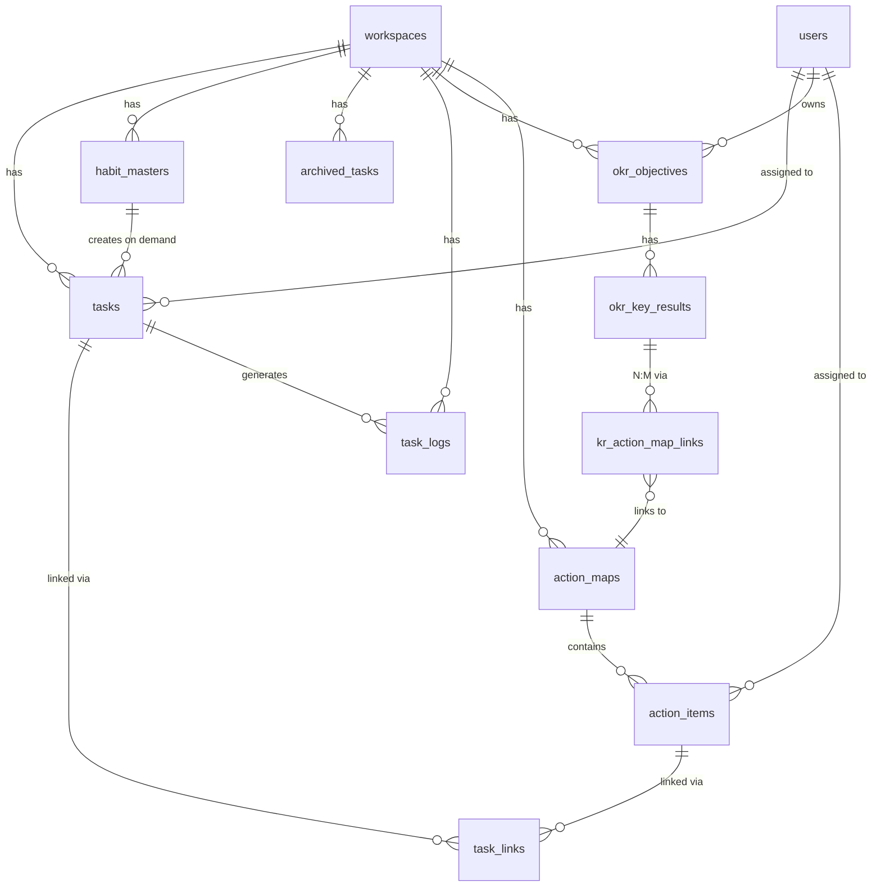

# Phase 16: タスク＆習慣システム v4 ランブック

## 概要

**UI は維持、ロジックはゼロベースで再構築、DB は正規化**

破壊的変更を許容し、10万ワークスペース規模にスケールする堅牢なタスク管理システムを構築する。

---

## Phase 16-17-18 連携アーキテクチャ

### 設計決定事項（確定）

以下の3点は議論の結果、確定した設計方針である。

```
┌─────────────────────────────────────────────────────────────────────────────┐
│                         設計決定事項（3つの根本的な問い）                      │
├─────────────────────────────────────────────────────────────────────────────┤
│                                                                             │
│  1. KR直結型は廃止 → ActionMap経由に統一                                    │
│     ─────────────────────────────────────────────────────────────────────   │
│     ・すべてのKRはActionMap経由で進捗を計算                                  │
│     ・シンプルなKRには「スケルトンActionMap」を自動生成                       │
│     ・task_links.target_type = 'action_item' のみ許可                       │
│     ・ダブルカウント防止ロジックは不要になる                                  │
│                                                                             │
│  2. 進捗伝播は同期                                                          │
│     ─────────────────────────────────────────────────────────────────────   │
│     ・タスク完了時に即座にKR進捗まで反映                                     │
│     ・将来の非同期化は propagateProgressUpdate() を差し替えるだけで可能      │
│     ・MVP段階ではシンプルさを優先                                           │
│                                                                             │
│  3. 進捗計算の責務は Phase 18 に集約                                        │
│     ─────────────────────────────────────────────────────────────────────   │
│     ・Phase 16: タスク完了 → イベント発火のみ（onTaskCompleted）            │
│     ・Phase 17: ActionMap進捗の計算（ActionItem集計）                       │
│     ・Phase 18: KR/Objective進捗の計算 + 全体の進捗伝播オーケストレーション  │
│                                                                             │
└─────────────────────────────────────────────────────────────────────────────┘
```

### 統一された進捗経路

```
【唯一の進捗経路】（KR直結型は廃止）

Task ─────▶ ActionItem ─────▶ ActionMap ─────▶ KR ─────▶ Objective
  │           │                 │               │           │
  │  task_links               N:M            kr_action_map_links
  │  (target_type=            (1 AM に複数     (1 KR に複数
  │   'action_item')           ActionItem)     ActionMap)
  │
  ▼
task_logs（完了の事実を記録）
```

### 3層アーキテクチャ図

```
┌─────────────────────────────────────────────────────────────────────────────┐
│                    3層アーキテクチャ（Phase 16-17-18 連携）                   │
├─────────────────────────────────────────────────────────────────────────────┤
│                                                                             │
│  【戦略層】Phase 18: OKR v2（進捗計算の責務を集約）                           │
│  ┌────────────────────────────────────────────────────────────────────┐    │
│  │ Objective ──1:N──▶ KeyResult                                       │    │
│  │     ▲                   │                                          │    │
│  │     │ 進捗ロールアップ    │ N:M (kr_action_map_links)                │    │
│  │     │ ※Phase 18が計算   │ ※KR直結は廃止                           │    │
│  └─────┼───────────────────┼──────────────────────────────────────────┘    │
│        │                   │                                               │
│  ┌─────┼───────────────────┼──────────────────────────────────────────┐    │
│  │     │ 【戦術層】Phase 17: ActionMap v2                              │    │
│  │     │                   ▼                                          │    │
│  │     │           ActionMap ──1:N──▶ ActionItem                      │    │
│  │     │               │                   │                          │    │
│  │     │               │ template_id       │ task_links               │    │
│  │     │               ▼                   │ (target_type=            │    │
│  │     │         MapTemplate               │  'action_item' のみ)     │    │
│  └─────┼───────────────────────────────────┼──────────────────────────┘    │
│        │                                   │                               │
│  ┌─────┼───────────────────────────────────┼──────────────────────────┐    │
│  │     │ 【実行層】Phase 16: Task System v4                            │    │
│  │     │                                   ▼                          │    │
│  │     └──────────────────────────────── Tasks                        │    │
│  │                                          │                         │    │
│  │                                          │ 完了 → イベント発火     │    │
│  │                                          ▼                         │    │
│  │                                      task_logs                     │    │
│  │                                      onTaskCompleted() ────────────┼───▶ Phase 18
│  └────────────────────────────────────────────────────────────────────┘    │
│                                                                             │
│  【進捗伝播チェーン】（唯一の経路）                                           │
│  Task完了 → onTaskCompleted() → Phase 18: recalculateProgressChain()       │
│           → ActionItem → ActionMap → KR → Objective                        │
│                                                                             │
└─────────────────────────────────────────────────────────────────────────────┘
```

### 関連ランブック

| Phase | ランブック | 責務 | 並行開発 |
|-------|-----------|------|---------|
| 16 | `PHASE16-TASK-SYSTEM-V4-RUNBOOK.md` | 実行層：タスク・習慣・完了イベント発火 | ✅ 独立開発可 |
| 17 | `PHASE17-ACTION-MAP-V2-RUNBOOK.md` | 戦術層：テンプレート・アサイン・ActionMap進捗 | ✅ 独立開発可 |
| 18 | `PHASE18-OKR-V2-RUNBOOK.md` | 戦略層：OKR管理・進捗伝播オーケストレーション | ✅ 独立開発可 |

### 並行開発のためのインターフェース契約

各Phaseは以下のインターフェースを通じて連携する。実装詳細に依存せず、契約のみで開発可能。

```typescript
// ═══════════════════════════════════════════════════════════════════════════
// Phase 16 → Phase 18 インターフェース（タスク完了時）
// ═══════════════════════════════════════════════════════════════════════════
interface TaskCompletedEvent {
  taskId: string;
  workspaceId: number;
  userId: number;
  completedAt: string;
  actualMinutes: number;
  linkedActionItemIds: string[];  // task_links から取得
}

// Phase 16 が呼び出す（実装は Phase 18）
declare function onTaskCompleted(event: TaskCompletedEvent): Promise<void>;

// ═══════════════════════════════════════════════════════════════════════════
// Phase 17 → Phase 18 インターフェース（ActionMap進捗更新時）
// ═══════════════════════════════════════════════════════════════════════════
interface ActionMapProgressUpdatedEvent {
  actionMapId: string;
  workspaceId: number;
  newProgressRate: number;
  updatedAt: string;
}

// Phase 17 が呼び出す（実装は Phase 18）
declare function onActionMapProgressUpdated(event: ActionMapProgressUpdatedEvent): Promise<void>;

// ═══════════════════════════════════════════════════════════════════════════
// Phase 18 が提供するAPI（Phase 16/17 から参照）
// ═══════════════════════════════════════════════════════════════════════════
interface ProgressService {
  // ActionItem の進捗を再計算（Task完了時に呼び出される）
  recalculateActionItemProgress(actionItemId: string): Promise<number>;

  // ActionMap の進捗を再計算（ActionItem更新時に呼び出される）
  recalculateActionMapProgress(actionMapId: string): Promise<number>;

  // KR の進捗を再計算（ActionMap更新時に呼び出される）
  recalculateKeyResultProgress(keyResultId: string): Promise<number>;

  // Objective の進捗を再計算（KR更新時に呼び出される）
  recalculateObjectiveProgress(objectiveId: string): Promise<number>;

  // 進捗伝播チェーン全体を実行
  propagateProgressFromTask(taskId: string): Promise<void>;
}

// ═══════════════════════════════════════════════════════════════════════════
// スケルトンActionMap 自動生成（Phase 17 が提供、Phase 18 から呼び出し）
// ═══════════════════════════════════════════════════════════════════════════
interface SkeletonActionMapRequest {
  workspaceId: number;
  keyResultId: string;
  title: string;  // KRタイトルから自動生成
}

interface SkeletonActionMapResponse {
  actionMapId: string;
  actionItemId: string;  // 1つのActionItemを自動生成
}

// Phase 17 が提供する関数
declare function createSkeletonActionMap(req: SkeletonActionMapRequest): Promise<SkeletonActionMapResponse>;
```

### 開発順序と依存関係

```
┌─────────────────────────────────────────────────────────────────────────────┐
│                         並行開発ガイド                                       │
├─────────────────────────────────────────────────────────────────────────────┤
│                                                                             │
│  【独立して開発可能】                                                         │
│                                                                             │
│  Phase 16（実行層）          Phase 17（戦術層）          Phase 18（戦略層）   │
│  ┌───────────────┐         ┌───────────────┐          ┌───────────────┐    │
│  │ tasks テーブル │         │ action_maps    │          │ okr_objectives│    │
│  │ task_logs     │         │ action_items   │          │ okr_key_results│   │
│  │ habit_masters │         │ map_templates  │          │ kr_action_map_ │   │
│  │ task_links    │         │                │          │   links        │   │
│  └───────┬───────┘         └───────┬───────┘          └───────┬───────┘    │
│          │                         │                          │             │
│          │ onTaskCompleted()       │ onActionMapProgress      │             │
│          │ (イベント発火)           │ Updated() (イベント発火)  │             │
│          │                         │                          │             │
│          └─────────────────────────┴──────────────────────────┘             │
│                                    │                                         │
│                                    ▼                                         │
│                          ┌─────────────────────┐                            │
│                          │ Phase 18            │                            │
│                          │ ProgressService     │                            │
│                          │ (進捗計算を集約)     │                            │
│                          └─────────────────────┘                            │
│                                                                             │
│  【統合フェーズ】                                                             │
│  各Phaseの開発完了後、インターフェース接続をテスト                             │
│                                                                             │
└─────────────────────────────────────────────────────────────────────────────┘
```

### 共通シーケンス図（GEMINI採用）

3 つのランブックで同一の図を参照。変更時に 1 カ所だけ更新すれば全体が同期される。

```
┌─────────────────────────────────────────────────────────────────────────────┐
│                    UI → Service → DB シーケンス                             │
├─────────────────────────────────────────────────────────────────────────────┤
│                                                                             │
│  ┌──────────┐       ┌────────────────┐       ┌───────────────┐             │
│  │    UI    │       │    Service     │       │      DB       │             │
│  │  (React) │       │  (API Routes)  │       │  (PostgreSQL) │             │
│  └────┬─────┘       └───────┬────────┘       └───────┬───────┘             │
│       │                     │                        │                      │
│       │ 1. ユーザー操作      │                        │                      │
│       │ (タスク完了/D&D)     │                        │                      │
│       │                     │                        │                      │
│       │──── API Request ───▶│                        │                      │
│       │ PATCH /v1/.../tasks │                        │                      │
│       │                     │                        │                      │
│       │                     │──── Transaction ──────▶│                      │
│       │                     │ BEGIN                  │                      │
│       │                     │                        │                      │
│       │                     │ 2. Task 更新           │                      │
│       │                     │───────────────────────▶│                      │
│       │                     │                        │                      │
│       │                     │ 3. task_logs 記録      │                      │
│       │                     │───────────────────────▶│                      │
│       │                     │                        │                      │
│       │                     │ 4. 進捗伝播            │                      │
│       │                     │ (ActionItem → AM → KR) │                      │
│       │                     │───────────────────────▶│                      │
│       │                     │                        │                      │
│       │                     │ COMMIT                 │                      │
│       │                     │───────────────────────▶│                      │
│       │                     │                        │                      │
│       │                     │ 5. キャッシュ無効化    │                      │
│       │                     │───────────────────────▶│ Redis                │
│       │                     │                        │                      │
│       │◀─── API Response ───│                        │                      │
│       │ { task, undoUrl }   │                        │                      │
│       │                     │                        │                      │
│       │ 6. UI 更新 + Undo   │                        │                      │
│       │    スナックバー表示  │                        │                      │
│       │                     │                        │                      │
│       │                     │ 7. Realtime 通知      │                      │
│       │◀════ WebSocket ════│◀───────────────────────│                      │
│       │                     │                        │                      │
└───────┴─────────────────────┴────────────────────────┴──────────────────────┘
```

**レイヤー対応表:**

| レイヤー | 責務 | 対応 Phase |
|---------|------|-----------|
| UI層 | ユーザー操作、楽観的更新、Undo | 16/17/18 共通 |
| サービス層 | API Routes、ビジネスロジック | 16/17/18 共通 |
| データ層 | PostgreSQL、Redis、Realtime | 16/17/18 共通 |

---

## 設計原則

1. **UI優先**: 現在のUIを100%維持（4象限/習慣/予定/履歴タブ）
2. **DB正規化**: workspace_data JSON → 正規化テーブルへ完全移行
3. **位置ベース**: `position` でドラッグ&ドロップに対応
4. **楽観的更新**: UI即時反映 → コマンドベース同期
5. **OKR/ActionMap連携**: task_links 中間テーブルで疎結合
6. **Googleカレンダー連動**: ゴミ箱移動でイベント削除、復元で再作成

---

## 保持するUI（変更禁止）

### タブ構成

```typescript
// app/_components/todo/task-board-tab/types.ts
type ViewMode = 'board' | 'habits' | 'schedule' | 'history';
```

```
┌────────────────────────────────────────────────────────────┐
│  [4象限]  [習慣]  [予定]  [履歴]    ← ViewModeTabBar.tsx   │
├────────────────────────────────────────────────────────────┤
│                                                            │
│  ┌─────────────────┬─────────────────┐                    │
│  │  ♠ Spade        │  ♥ Heart        │                    │
│  │                 │                 │                    │
│  ├─────────────────┼─────────────────┤  ← 4象限ボード     │
│  │  ♦ Diamond      │  ♣ Club         │                    │
│  │                 │                 │                    │
│  ├───────────────────────┬──────────┤                    │
│  │  🃏 Joker              │ 🗑️ Trash │  ← ジョーカー+ゴミ箱│
│  └───────────────────────┴──────────┘                    │
│                                                            │
└────────────────────────────────────────────────────────────┘
```

### 予定タブ（TodaySchedule.tsx）

```
┌────────────────────────────────────────────────────────────┐
│  予定  12/5(木)  [昨日] [今日] [明日]  🔄                   │
├────────────────────────────────────────────────────────────┤
│  09:00  ⬛ 朝MTG                        ← Googleカレンダー │
│  10:00  🟥 運動（竹）15分                                  │
│  14:00  未分類イベント → [♠][♥][♦][♣]  ← 手動分類UI      │
│  ...                                                       │
└────────────────────────────────────────────────────────────┘
```

### 習慣タブ（ElasticHabitsPanel.tsx）

```
┌────────────────────────────────────────────────────────────┐
│  習慣マスタ管理                                            │
│  + 新しい習慣を追加                                        │
├────────────────────────────────────────────────────────────┤
│  運動  [梅 5分] [竹 15分] [松 30分]                        │
│  読書  [梅 5分] [竹 15分] [松 30分]                        │
│  瞑想  [梅 5分] [竹 15分] [松 30分]                        │
└────────────────────────────────────────────────────────────┘
```

---

## データベーススキーマ（PostgreSQL）

### ER図



**注意:** KR ↔ Task の直結リンクは廃止されました。
すべての進捗は `Task → ActionItem → ActionMap → KR → Objective` の経路で伝播します。

### コアテーブル

#### tasks（タスク・習慣統合）

```sql
CREATE TABLE tasks (
  -- Primary Key
  id UUID PRIMARY KEY DEFAULT gen_random_uuid(),
  workspace_id INTEGER NOT NULL REFERENCES workspaces(id) ON DELETE CASCADE,

  -- Basic Info
  title TEXT NOT NULL,
  description TEXT,

  -- Position & Type
  position TEXT NOT NULL DEFAULT 'joker'
    CHECK (position IN ('spade', 'heart', 'diamond', 'club', 'joker', 'trash')),
  task_type TEXT NOT NULL DEFAULT 'task'
    CHECK (task_type IN ('task', 'habit')),
  status TEXT NOT NULL DEFAULT 'not_started'
    CHECK (status IN ('not_started', 'in_progress', 'done', 'canceled')),

  -- Scheduling
  scheduled_date DATE,
  start_at TIME,
  duration_minutes INTEGER,
  suggested_duration INTEGER,

  -- Habit Fields (task_type = 'habit')
  habit_master_id UUID REFERENCES habit_masters(id),
  elastic_level TEXT CHECK (elastic_level IN ('ume', 'take', 'matsu')),
  streak_count INTEGER DEFAULT 0,
  last_completed_at TIMESTAMPTZ,

  -- Sub-items (JSONB for flexibility)
  sub_tasks JSONB DEFAULT '[]'::jsonb,
  linked_habits JSONB DEFAULT '[]'::jsonb,

  -- External Integrations
  google_calendar_event_id TEXT,
  google_task_id TEXT,

  -- Multi-user
  user_id INTEGER NOT NULL REFERENCES users(id),
  assignee_id INTEGER REFERENCES users(id),

  -- Soft Delete
  trashed_at TIMESTAMPTZ,
  -- Note: original_position は使用しない。復元先はユーザーが毎回選択する設計。

  -- Optimistic Locking
  version INTEGER NOT NULL DEFAULT 1,

  -- Drag & Drop Sort Order (Fractional Indexing)
  sort_order TEXT NOT NULL DEFAULT 'a0',

  -- Timestamps（他テーブルと統一のため TIMESTAMPTZ を使用）
  created_at TIMESTAMPTZ NOT NULL DEFAULT NOW(),
  updated_at TIMESTAMPTZ NOT NULL DEFAULT NOW()
);

-- Indexes
CREATE INDEX idx_tasks_workspace_position ON tasks(workspace_id, position) WHERE trashed_at IS NULL;
CREATE INDEX idx_tasks_workspace_date ON tasks(workspace_id, scheduled_date) WHERE trashed_at IS NULL;
CREATE INDEX idx_tasks_workspace_status ON tasks(workspace_id, status);
CREATE INDEX idx_tasks_workspace_assignee ON tasks(workspace_id, assignee_id);
CREATE INDEX idx_tasks_user_status ON tasks(user_id, status) WHERE trashed_at IS NULL;  -- ユーザー単位タスク一覧高速化
CREATE INDEX idx_tasks_gcal_event ON tasks(google_calendar_event_id) WHERE google_calendar_event_id IS NOT NULL;
CREATE INDEX idx_tasks_trashed ON tasks(workspace_id, trashed_at) WHERE trashed_at IS NOT NULL;
CREATE INDEX idx_tasks_updated ON tasks(workspace_id, updated_at DESC);
CREATE INDEX idx_tasks_workspace_version ON tasks(workspace_id, id, version);  -- 楽観ロック用
CREATE INDEX idx_tasks_workspace_pos_sort ON tasks(workspace_id, position, scheduled_date, sort_order);  -- D&D並び順用

-- Enable Realtime
ALTER PUBLICATION supabase_realtime ADD TABLE tasks;
```

#### habit_masters（習慣マスタ）

```sql
CREATE TABLE habit_masters (
  id UUID PRIMARY KEY DEFAULT gen_random_uuid(),
  workspace_id INTEGER NOT NULL REFERENCES workspaces(id) ON DELETE CASCADE,

  title TEXT NOT NULL,
  description TEXT,
  target_position TEXT NOT NULL DEFAULT 'heart'
    CHECK (target_position IN ('heart', 'club')),

  -- Levels (松竹梅)
  level_ume_label TEXT NOT NULL,
  level_ume_minutes INTEGER NOT NULL DEFAULT 5,
  level_take_label TEXT NOT NULL,
  level_take_minutes INTEGER NOT NULL DEFAULT 15,
  level_matsu_label TEXT NOT NULL,
  level_matsu_minutes INTEGER NOT NULL DEFAULT 30,

  -- Streak
  streak_count INTEGER DEFAULT 0,
  longest_streak INTEGER DEFAULT 0,
  last_completed_at TIMESTAMPTZ,

  -- Metadata
  is_archived BOOLEAN DEFAULT FALSE,
  created_at BIGINT NOT NULL DEFAULT (EXTRACT(EPOCH FROM NOW()) * 1000)::BIGINT,
  updated_at BIGINT NOT NULL DEFAULT (EXTRACT(EPOCH FROM NOW()) * 1000)::BIGINT
);

CREATE INDEX idx_habit_masters_workspace ON habit_masters(workspace_id) WHERE NOT is_archived;
```

#### archived_tasks（アーカイブ）

```sql
CREATE TABLE archived_tasks (
  id UUID PRIMARY KEY,
  workspace_id INTEGER NOT NULL REFERENCES workspaces(id) ON DELETE CASCADE,

  -- Original task data (snapshot)
  task_data JSONB NOT NULL,

  -- Archive info
  archived_at TIMESTAMPTZ NOT NULL DEFAULT NOW(),
  archived_reason TEXT NOT NULL
    CHECK (archived_reason IN ('trash_expired', 'manual_delete', 'completed', 'bulk_cleanup')),
  -- ┌─────────────────────────────────────────────────────────────────┐
  -- │ archived_reason 使用状況（現時点）:                              │
  -- │  - 'trash_expired': ✅ 使用中（30日経過バッチで自動アーカイブ）    │
  -- │  - 'manual_delete': 🔜 将来拡張用（管理者による即時削除）          │
  -- │  - 'completed':     🔜 将来拡張用（完了済みタスクの定期アーカイブ）│
  -- │  - 'bulk_cleanup':  🔜 将来拡張用（一括クリーンアップ処理）        │
  -- └─────────────────────────────────────────────────────────────────┘

  -- For analytics
  original_position TEXT,
  original_status TEXT,
  completed_at TIMESTAMPTZ
);

CREATE INDEX idx_archived_tasks_workspace ON archived_tasks(workspace_id, archived_at DESC);
-- Partition by year-month for large scale
-- CREATE TABLE archived_tasks_2025_12 PARTITION OF archived_tasks FOR VALUES FROM ('2025-12-01') TO ('2026-01-01');
```

#### task_logs（完了ログ）

```sql
CREATE TABLE task_logs (
  id UUID PRIMARY KEY DEFAULT gen_random_uuid(),
  workspace_id INTEGER NOT NULL REFERENCES workspaces(id) ON DELETE CASCADE,
  task_id UUID NOT NULL,

  -- Snapshot
  title TEXT NOT NULL,
  position TEXT,
  task_type TEXT,
  elastic_level TEXT,

  -- Completion info
  completed_at TIMESTAMPTZ NOT NULL DEFAULT NOW(),
  completed_date DATE NOT NULL DEFAULT CURRENT_DATE,
  planned_minutes INTEGER,
  actual_minutes INTEGER,
  streak_at_completion INTEGER,

  -- Review
  note TEXT,
  rating INTEGER CHECK (rating BETWEEN 1 AND 5),

  created_at BIGINT NOT NULL DEFAULT (EXTRACT(EPOCH FROM NOW()) * 1000)::BIGINT
);

CREATE INDEX idx_task_logs_workspace_date ON task_logs(workspace_id, completed_date DESC);
CREATE INDEX idx_task_logs_task ON task_logs(task_id);
```

### OKR / ActionMap 連携テーブル

#### okr_objectives（目標）

```sql
CREATE TABLE okr_objectives (
  id UUID PRIMARY KEY DEFAULT gen_random_uuid(),
  workspace_id INTEGER NOT NULL REFERENCES workspaces(id) ON DELETE CASCADE,

  title TEXT NOT NULL,
  description TEXT,
  scope TEXT NOT NULL DEFAULT 'team'
    CHECK (scope IN ('company', 'team', 'individual')),

  owner_user_id INTEGER NOT NULL REFERENCES users(id),
  period_start DATE,
  period_end DATE,

  progress_rate DECIMAL(5,2) DEFAULT 0,
  status TEXT DEFAULT 'on_track'
    CHECK (status IN ('on_track', 'at_risk', 'off_track', 'completed')),

  is_archived BOOLEAN DEFAULT FALSE,
  created_at TIMESTAMPTZ NOT NULL DEFAULT NOW(),
  updated_at TIMESTAMPTZ NOT NULL DEFAULT NOW()
);

CREATE INDEX idx_okr_objectives_workspace ON okr_objectives(workspace_id) WHERE NOT is_archived;
```

#### okr_key_results（成果指標）

```sql
CREATE TABLE okr_key_results (
  id UUID PRIMARY KEY DEFAULT gen_random_uuid(),
  workspace_id INTEGER NOT NULL REFERENCES workspaces(id) ON DELETE CASCADE,
  objective_id UUID NOT NULL REFERENCES okr_objectives(id) ON DELETE CASCADE,

  title TEXT NOT NULL,
  target_value DECIMAL(12,2),
  current_value DECIMAL(12,2) DEFAULT 0,
  unit TEXT,

  is_qualitative BOOLEAN DEFAULT FALSE,
  is_achieved BOOLEAN DEFAULT FALSE,

  -- ★ 設計決定: calc_method は廃止（Phase 18 参照）
  -- すべての KR は ActionMap 経由で進捗計算する。
  -- 既存データ互換のため一時的に残すが、新規作成時は使用しない。
  calc_method TEXT DEFAULT 'manual',
  -- CHECK制約は削除（移行期間中の互換性のため）

  progress_rate DECIMAL(5,2) DEFAULT 0,
  owner_user_id INTEGER NOT NULL REFERENCES users(id),

  created_at TIMESTAMPTZ NOT NULL DEFAULT NOW(),
  updated_at TIMESTAMPTZ NOT NULL DEFAULT NOW()
);

CREATE INDEX idx_okr_kr_objective ON okr_key_results(objective_id);
CREATE INDEX idx_okr_kr_workspace ON okr_key_results(workspace_id);
```

#### action_maps（戦術計画）

```sql
CREATE TABLE action_maps (
  id UUID PRIMARY KEY DEFAULT gen_random_uuid(),
  workspace_id INTEGER NOT NULL REFERENCES workspaces(id) ON DELETE CASCADE,

  title TEXT NOT NULL,
  description TEXT,
  owner_user_id INTEGER NOT NULL REFERENCES users(id),

  target_period_start DATE,
  target_period_end DATE,
  progress_rate DECIMAL(5,2) DEFAULT 0,

  is_archived BOOLEAN DEFAULT FALSE,
  created_at TIMESTAMPTZ NOT NULL DEFAULT NOW(),
  updated_at TIMESTAMPTZ NOT NULL DEFAULT NOW()
);

CREATE INDEX idx_action_maps_workspace ON action_maps(workspace_id) WHERE NOT is_archived;
```

#### action_items（アクション項目）

```sql
CREATE TABLE action_items (
  id UUID PRIMARY KEY DEFAULT gen_random_uuid(),
  workspace_id INTEGER NOT NULL REFERENCES workspaces(id) ON DELETE CASCADE,
  action_map_id UUID NOT NULL REFERENCES action_maps(id) ON DELETE CASCADE,
  parent_item_id UUID REFERENCES action_items(id),

  title TEXT NOT NULL,
  description TEXT,
  assignee_user_id INTEGER REFERENCES users(id),
  due_date DATE,
  priority TEXT DEFAULT 'medium'
    CHECK (priority IN ('low', 'medium', 'high')),
  status TEXT NOT NULL DEFAULT 'not_started'
    CHECK (status IN ('not_started', 'in_progress', 'blocked', 'done')),

  progress_rate DECIMAL(5,2) DEFAULT 0,
  sort_order INTEGER DEFAULT 0,

  created_at TIMESTAMPTZ NOT NULL DEFAULT NOW(),
  updated_at TIMESTAMPTZ NOT NULL DEFAULT NOW()
);

CREATE INDEX idx_action_items_map ON action_items(action_map_id);
CREATE INDEX idx_action_items_parent ON action_items(parent_item_id);
```

#### task_links（タスク連携 - 中間テーブル）

```sql
CREATE TABLE task_links (
  id UUID PRIMARY KEY DEFAULT gen_random_uuid(),
  workspace_id INTEGER NOT NULL REFERENCES workspaces(id) ON DELETE CASCADE,
  task_id UUID NOT NULL REFERENCES tasks(id) ON DELETE CASCADE,

  -- ★ 設計決定: ActionItem経由のみ（KR直結は廃止）
  target_type TEXT NOT NULL DEFAULT 'action_item'
    CHECK (target_type = 'action_item'),
  -- Note: KR直結型は廃止。すべてのタスクは ActionItem 経由で KR に貢献する。
  -- シンプルなKRには「スケルトンActionMap」が自動生成される。

  target_id UUID NOT NULL REFERENCES action_items(id) ON DELETE CASCADE,

  -- Metadata
  created_at TIMESTAMPTZ NOT NULL DEFAULT NOW(),

  UNIQUE(task_id, target_id)  -- target_type は常に action_item なので省略
);

CREATE INDEX idx_task_links_task ON task_links(task_id);
CREATE INDEX idx_task_links_action_item ON task_links(target_id);  -- ActionItem検索高速化
CREATE INDEX idx_task_links_workspace ON task_links(workspace_id);
```

#### task_links 運用ポリシー（シンプル化）

```
┌─────────────────────────────────────────────────────────────────────────────┐
│ ■ 唯一のリンク方針（設計決定で統一）                                           │
│                                                                             │
│   Task → task_links → ActionItem → ActionMap → KR → Objective              │
│                                                                             │
│   ・すべてのタスクは ActionItem にのみリンク可能                               │
│   ・KR直結型は廃止（ダブルカウント問題を根本解決）                              │
│   ・シンプルなKRには Phase 17 がスケルトンActionMap を自動生成                 │
│                                                                             │
│ ■ ワークスペース整合性                                                        │
│   - Task と ActionItem の workspace_id は一致必須                            │
│   - トリガーで自動検証（異なる場合はエラー）                                   │
│                                                                             │
│ ■ 集計ルール                                                                 │
│   - ActionItem 単位で集計（Task の重複カウントなし）                           │
│   - workspace_id を必ずWHERE条件に含める                                      │
│                                                                             │
└─────────────────────────────────────────────────────────────────────────────┘
```

#### notifications（共通通知テーブル）

Phase 16/17/18 で共通使用する通知テーブル。

```sql
CREATE TABLE notifications (
  id UUID PRIMARY KEY DEFAULT gen_random_uuid(),
  workspace_id INTEGER NOT NULL REFERENCES workspaces(id) ON DELETE CASCADE,
  user_id INTEGER NOT NULL REFERENCES users(id) ON DELETE CASCADE,

  notification_type TEXT NOT NULL,
    -- Task関連: 'task_assigned', 'task_completed', 'task_overdue'
    -- ActionMap関連: 'action_item_assigned', 'action_item_accepted', 'action_item_rejected',
    --                'action_item_completed', 'action_item_overdue', 'action_map_progress'
    -- OKR関連: 'key_result_progress', 'key_result_achieved', 'objective_period_ending'

  title TEXT NOT NULL,
  message TEXT,
  link_url TEXT,  -- クリック時の遷移先

  -- Polymorphic reference to source entity
  related_id UUID,
  related_type TEXT,  -- 'task', 'action_item', 'action_map', 'key_result', 'objective'

  is_read BOOLEAN DEFAULT FALSE,
  read_at TIMESTAMPTZ,

  created_at TIMESTAMPTZ NOT NULL DEFAULT NOW()
);

CREATE INDEX idx_notifications_user_unread ON notifications(user_id, is_read) WHERE is_read = FALSE;
CREATE INDEX idx_notifications_workspace ON notifications(workspace_id, created_at DESC);
```

### 日次・月次サマリー

```sql
CREATE TABLE daily_summaries (
  id UUID PRIMARY KEY DEFAULT gen_random_uuid(),
  workspace_id INTEGER NOT NULL REFERENCES workspaces(id) ON DELETE CASCADE,
  summary_date DATE NOT NULL,

  spade_minutes INTEGER DEFAULT 0,
  heart_minutes INTEGER DEFAULT 0,
  diamond_minutes INTEGER DEFAULT 0,
  club_minutes INTEGER DEFAULT 0,
  joker_minutes INTEGER DEFAULT 0,
  total_minutes INTEGER DEFAULT 0,

  task_count INTEGER DEFAULT 0,
  habit_completions INTEGER DEFAULT 0,
  effectiveness_rate DECIMAL(5,2),

  created_at TIMESTAMPTZ NOT NULL DEFAULT NOW(),

  UNIQUE(workspace_id, summary_date)
);

CREATE INDEX idx_daily_summaries_workspace_date ON daily_summaries(workspace_id, summary_date DESC);

CREATE TABLE monthly_summaries (
  id UUID PRIMARY KEY DEFAULT gen_random_uuid(),
  workspace_id INTEGER NOT NULL REFERENCES workspaces(id) ON DELETE CASCADE,
  year_month TEXT NOT NULL, -- 'YYYY-MM'

  spade_minutes INTEGER DEFAULT 0,
  heart_minutes INTEGER DEFAULT 0,
  diamond_minutes INTEGER DEFAULT 0,
  club_minutes INTEGER DEFAULT 0,
  joker_minutes INTEGER DEFAULT 0,
  total_minutes INTEGER DEFAULT 0,

  total_task_count INTEGER DEFAULT 0,
  total_habit_completions INTEGER DEFAULT 0,
  active_days INTEGER DEFAULT 0,
  avg_daily_minutes DECIMAL(8,2),
  avg_effectiveness_rate DECIMAL(5,2),

  created_at TIMESTAMPTZ NOT NULL DEFAULT NOW(),

  UNIQUE(workspace_id, year_month)
);

CREATE INDEX idx_monthly_summaries_workspace ON monthly_summaries(workspace_id, year_month DESC);
```

---

## 削除・移動の責務分解

### 3レイヤー設計

ユーザー操作を「小さい UPDATE 一発」で完結させ、重い処理はバックグラウンドに分離する。

| レイヤー | 操作 | 実装 | タイミング |
|---------|------|------|-----------|
| **論理削除** | ユーザーの「削除」ボタン | `position = 'trash', trashed_at = NOW()` | 即時（UI即時反映） |
| **アーカイブ** | 30日経過後の自動移行 | `archived_tasks` へ INSERT + DELETE | 夜間バッチ |
| **物理削除** | 管理者の完全削除 | `archived_tasks` からの purge | 運用のみ |

### SQL例：論理削除（ユーザー操作）

```sql
-- 楽観ロック付き削除（ゴミ箱移動）
UPDATE tasks
SET
  position = 'trash',
  trashed_at = NOW(),
  updated_at = (EXTRACT(EPOCH FROM NOW()) * 1000)::BIGINT,
  version = version + 1
WHERE
  workspace_id = $workspace_id
  AND id = $task_id
  AND version = $current_version;

-- 影響行が 0 行 → 409 Conflict（誰かが先に更新）
-- 影響行が 1 行 → 成功
```

### SQL例：復元（ゴミ箱 → 4象限）

```sql
-- 楽観ロック付き復元
UPDATE tasks
SET
  position = $target_position,  -- 'joker' など
  trashed_at = NULL,
  updated_at = (EXTRACT(EPOCH FROM NOW()) * 1000)::BIGINT,
  version = version + 1
WHERE
  workspace_id = $workspace_id
  AND id = $task_id
  AND version = $current_version;
```

### SQL例：4象限間の移動

```sql
-- 楽観ロック付き移動（例: spade → heart）
UPDATE tasks
SET
  position = $new_position,
  sort_order = $new_sort_order,
  updated_at = (EXTRACT(EPOCH FROM NOW()) * 1000)::BIGINT,
  version = version + 1
WHERE
  workspace_id = $workspace_id
  AND id = $task_id
  AND version = $current_version;
```

### SQL例：並び順の変更（D&D）

```sql
-- 同じ象限内での並び替え
UPDATE tasks
SET
  sort_order = $new_sort_order,
  updated_at = (EXTRACT(EPOCH FROM NOW()) * 1000)::BIGINT,
  version = version + 1
WHERE
  workspace_id = $workspace_id
  AND id = $task_id
  AND version = $current_version;
```

### TypeScript実装例

```typescript
// lib/api/tasks/mutations.ts

export async function moveTask(
  supabase: SupabaseClient,
  taskId: string,
  workspaceId: number,
  updates: { position?: Position; sortOrder?: number; trashedAt?: string | null },
  currentVersion: number
): Promise<{ success: boolean; task?: Task; conflict?: boolean }> {
  const nowMs = Date.now();

  const { data, error, count } = await supabase
    .from('tasks')
    .update({
      ...updates,
      updated_at: nowMs,
      version: currentVersion + 1,
    })
    .eq('workspace_id', workspaceId)
    .eq('id', taskId)
    .eq('version', currentVersion)  // 楽観ロック
    .select()
    .single();

  if (error?.code === 'PGRST116' || count === 0) {
    // 0行更新 = バージョン競合
    return { success: false, conflict: true };
  }

  if (error) throw error;

  return { success: true, task: data };
}

// 使用例
const result = await moveTask(supabase, task.id, workspaceId, {
  position: 'trash',
  trashedAt: new Date().toISOString(),
}, task.version);

if (result.conflict) {
  await handleConflict(task.id, localTask);
}

/**
 * 競合発生時のUX処理
 * - ユーザーに通知（トースト表示）
 * - 最新データで UI を更新
 * - 自動リトライは行わない（ユーザーの意図を確認）
 */
async function handleConflict(taskId: string, localTask: Task) {
  // 1. 最新データを再取得
  const { data: freshTask } = await supabase
    .from('tasks')
    .select('*')
    .eq('id', taskId)
    .single();

  if (!freshTask) {
    // タスクが削除されていた場合
    showToast('このタスクは他のユーザーによって削除されました。', 'warning');
    removeFromLocalState(taskId);
    return;
  }

  // 2. 変更内容の差分を検出
  const conflicts = detectConflicts(localTask, freshTask);

  // 3. ユーザーに通知
  if (conflicts.includes('position')) {
    showToast(
      `他のユーザーがこのタスクを「${getPositionLabel(freshTask.position)}」に移動しました。`,
      'info'
    );
  } else if (conflicts.includes('status')) {
    showToast(
      `他のユーザーがこのタスクのステータスを変更しました。`,
      'info'
    );
  } else {
    showToast('他のユーザーが編集しました。最新の状態を表示します。', 'info');
  }

  // 4. UIを最新状態に更新（ユーザーの操作は破棄）
  updateLocalState(freshTask);
}

function detectConflicts(local: Task, server: Task): (keyof Task)[] {
  const conflictFields: (keyof Task)[] = [];
  if (local.position !== server.position) conflictFields.push('position');
  if (local.status !== server.status) conflictFields.push('status');
  if (local.title !== server.title) conflictFields.push('title');
  return conflictFields;
}
```

### アーカイブバッチ（夜間実行）

```sql
-- 30日以上前のゴミ箱タスクをまとめてアーカイブ
BEGIN;

-- 1. アーカイブテーブルに移動
INSERT INTO archived_tasks (id, workspace_id, task_data, archived_reason, original_position, original_status, completed_at)
SELECT
  id,
  workspace_id,
  to_jsonb(t),
  'trash_expired',
  position,
  status,
  CASE WHEN status = 'done' THEN to_timestamp(updated_at / 1000) END
FROM tasks t
WHERE trashed_at < NOW() - INTERVAL '30 days';

-- 2. 元テーブルから削除
DELETE FROM tasks
WHERE trashed_at < NOW() - INTERVAL '30 days';

COMMIT;
```

---

## 習慣ゾーン設計（Heart / Club 内）

### 概要

4象限タスクボードの ♥ Heart と ♣ Club 象限に「習慣ゾーン」を表示し、毎日の習慣を梅・竹・松の3レベルで実行できる機能。

### レイアウトルール

Heart と Club の象限内に「習慣ゾーン」を設置し、通常タスクと視覚的に区別する。

```
┌─────────────────┬─────────────────┐
│  ♠ Spade        │  ♥ Heart        │
│  [通常タスク]    │  [通常タスク]    │
│                 │                 │
│                 │  ─────────────  │
│                 │  📌 習慣ゾーン   │
│                 │  [梅][竹][松]   │  ← レベル選択ボタン
│                 │  [習慣タスク]    │
├─────────────────┼─────────────────┤
│  ♦ Diamond      │  ♣ Club         │
│  [通常タスク]    │  [通常タスク]    │
│                 │                 │
│                 │  ─────────────  │
│                 │  📌 習慣ゾーン   │
│                 │  [梅][竹][松]   │
│                 │  [習慣タスク]    │
└─────────────────┴─────────────────┘
```

### 習慣ブロックUI

**レベル選択ボタン:**
- 梅・竹・松の3つのボタンを横並びで表示
- 各ボタンをクリックすると:
  1. 習慣選択ダイアログが開く（竹・松の場合）
  2. 梅の場合は「梅セット」として全習慣をまとめて作成
  3. 対象日（今日/明日）と時間帯（朝/夜/カスタム）を選択
  4. 「予定を作成」で習慣タスクが作成される
  5. UIに即座に反映（楽観的更新）
  6. Googleカレンダーにイベント作成

**習慣タスクの操作:**
- 完了チェックボックス: タスクを完了にする（ストリーク更新）
- 削除ボタン（×）: 確認後にタスクを削除
- クリック: 詳細表示/編集

### 操作フロー

**習慣タスクの作成:**
1. ユーザーが習慣ゾーンの「竹」ボタンをクリック
2. 習慣選択ダイアログが開く
3. 習慣マスタを選択（例: 運動）
4. 対象日と時間帯を選択
5. 「予定を作成」ボタンで習慣タスクが作成される
6. UIに即座に反映 → tasks テーブルにINSERT → GCal連携

**習慣タスクの完了:**
1. チェックボックスをクリック
2. UIに即座に反映
3. tasks.status = 'done' に更新
4. task_logs に記録
5. habit_masters.streak_count を更新
6. GCalイベントのタイトルに「✓」を追加

**習慣タスクの削除（不可）:**
- 習慣タスク個別の削除は**不可**
- 「今日はやらない」場合は**スキップボタン**を使用
- 習慣自体を廃止する場合は**習慣マスタをアーカイブ**（設定画面から）
- スキップ: `tasks.status = 'skipped'` に更新（streak はリセット）

**表示ルール:**
- Heart 習慣ゾーン: `task_type='habit' AND position='heart' AND scheduled_date=today`
- Club 習慣ゾーン: `task_type='habit' AND position='club' AND scheduled_date=today`
- 通常タスクと習慣タスクは**セクション分け**して表示（混在させない）
- 習慣ゾーンは象限の下部に固定配置

### 習慣タスク生成仕様（朝/夜選択 → タスク化）

**重要: 習慣は自動で日次生成しない**

ユーザーが「朝 or 夜」に習慣タブまたは4象限ボードを開き、明示的に選択したタイミングでのみタスク化する。

**ユーザーフロー:**

```
┌────────────────────────────────────────────────────────────┐
│  習慣タブ / 習慣ゾーン                                      │
├────────────────────────────────────────────────────────────┤
│  運動  [Heart]                     🔥 5日連続              │
│  ┌─────────────────────────────────────────────────────┐  │
│  │  対象日:   [今日] [明日]                             │  │
│  │  時間帯:   [朝 7:00] [夜 22:00] [カスタム ___:___]   │  │
│  │  レベル:   [梅 5分] [竹 15分] [松 30分]             │  │
│  │                                                      │  │
│  │              [📅 予定を作成]                         │  │
│  └─────────────────────────────────────────────────────┘  │
│                                                            │
│  読書  [Club]                      🔥 12日連続             │
│  ...                                                       │
└────────────────────────────────────────────────────────────┘
```

**生成される tasks レコード:**

| フィールド | 値 |
|-----------|-----|
| `task_type` | `'habit'` |
| `scheduled_date` | 今日 or 明日（選択に応じて） |
| `start_at` | 朝/夜プリセット or カスタム時刻 |
| `duration_minutes` | 選択レベルの minutes（梅5/竹15/松30） |
| `position` | `habit_masters.target_position`（'heart' or 'club'） |
| `elastic_level` | 選択したレベル |
| `status` | `'not_started'` |
| `google_calendar_event_id` | 作成後に設定 |

**TypeScript 実装:**

```typescript
// lib/hooks/task/useHabitExecution.ts

type PlanTargetDate = 'today' | 'tomorrow';
type PlanTimeOfDay = 'morning' | 'evening' | 'custom';

// 朝/夜のデフォルト時刻
const DEFAULT_TIMES = {
  morning: '07:00',
  evening: '22:00',
};

/**
 * 習慣をタスク化（予定を作成）
 * - 選択した瞬間に tasks に INSERT
 * - 同時に Google カレンダーにイベント作成
 */
async function planHabit(
  workspaceId: number,
  userId: number,
  habitMasterId: string,
  level: ElasticLevel,
  targetDate: PlanTargetDate,
  timeOfDay: PlanTimeOfDay,
  customTime?: string  // 'HH:MM'
): Promise<Task> {
  // 1. 習慣マスタを取得
  const { data: master } = await supabase
    .from('habit_masters')
    .select('*')
    .eq('id', habitMasterId)
    .single();

  if (!master) throw new Error('Habit master not found');

  // 2. 日付と時刻を決定
  const scheduledDate = targetDate === 'today'
    ? formatDate(new Date())
    : formatDate(addDays(new Date(), 1));

  const startAt = timeOfDay === 'custom'
    ? customTime!
    : DEFAULT_TIMES[timeOfDay];

  // 3. レベルに応じた分数を取得
  const durationMinutes = {
    ume: master.level_ume_minutes,
    take: master.level_take_minutes,
    matsu: master.level_matsu_minutes,
  }[level];

  // 4. タスクを作成
  const newTask = {
    workspace_id: workspaceId,
    user_id: userId,
    title: `${master.title}（${level === 'ume' ? '梅' : level === 'take' ? '竹' : '松'}）`,
    task_type: 'habit',
    position: master.target_position,
    status: 'not_started',
    scheduled_date: scheduledDate,
    start_at: startAt,
    duration_minutes: durationMinutes,
    habit_master_id: habitMasterId,
    elastic_level: level,
    version: 1,
    sort_order: 0,
  };

  const { data: task, error } = await supabase
    .from('tasks')
    .insert(newTask)
    .select()
    .single();

  if (error) throw error;

  // 5. Google カレンダーにイベント作成（#6 フォールバック付き）
  try {
    const eventId = await createCalendarEvent({
      title: task.title,
      date: scheduledDate,
      startTime: startAt,
      durationMinutes,
    });

    // 6. イベントIDを保存
    if (eventId) {
      await supabase
        .from('tasks')
        .update({ google_calendar_event_id: eventId })
        .eq('id', task.id);

      task.google_calendar_event_id = eventId;
    }
  } catch (gcalError) {
    // GCal API 失敗時: タスク作成は成功として続行
    console.error('[planHabit] GCal event creation failed:', gcalError);

    // リトライキューに追加（非同期で後から再試行）
    await addToGCalRetryQueue({
      taskId: task.id,
      operation: 'create',
      payload: {
        title: task.title,
        date: scheduledDate,
        startTime: startAt,
        durationMinutes,
      },
      retryCount: 0,
      createdAt: Date.now(),
    });

    // ユーザーには警告を表示（タスクは作成済み）
    showToast(
      'Googleカレンダーへの登録に失敗しました。後で再試行します。',
      'warning'
    );
  }

  return task;
}

/**
 * 通常タスクを完了
 * - status を 'done' に更新
 * - task_logs に記録
 * - OKR/ActionMap 進捗更新をトリガー
 */
async function completeTask(taskId: string): Promise<{
  task: Task;
  log: TaskLog;
}> {
  const now = new Date().toISOString();  // TIMESTAMPTZ 対応
  const today = formatDate(new Date());

  // 1. タスクを取得
  const { data: task } = await supabase
    .from('tasks')
    .select('*')
    .eq('id', taskId)
    .single();

  if (!task || task.task_type !== 'task') {
    throw new Error('Task not found or not a regular task');
  }

  // 2. タスクを完了にする（楽観ロック）
  const { error: updateError } = await supabase
    .from('tasks')
    .update({
      status: 'done',
      updated_at: now,
      version: task.version + 1,
    })
    .eq('id', taskId)
    .eq('version', task.version);

  if (updateError) throw updateError;

  // 3. task_logs に記録
  const { data: log } = await supabase
    .from('task_logs')
    .insert({
      workspace_id: task.workspace_id,
      task_id: task.id,
      title: task.title,
      position: task.position,
      task_type: 'task',
      completed_at: new Date().toISOString(),
      completed_date: today,
      planned_minutes: task.duration_minutes,
    })
    .select()
    .single();

  // 4. OKR/ActionMap 進捗更新をトリガー
  await onTaskCompleted({ ...task, status: 'done' });

  return {
    task: { ...task, status: 'done' },
    log: log!,
  };
}

/**
 * 習慣を実行（完了）
 * - status を 'done' に更新
 * - task_logs に記録
 * - habit_masters のストリーク更新
 * - ボード/習慣ゾーンから消し込み（未完了フィルタで除外）
 * - Google カレンダーイベントは削除しない（履歴として残す）
 */
async function executeHabit(taskId: string): Promise<{
  task: Task;
  log: TaskLog;
  streak: { current: number; longest: number };
}> {
  const now = new Date().toISOString();  // TIMESTAMPTZ 対応
  const today = formatDate(new Date());

  // 1. タスクを取得
  const { data: task } = await supabase
    .from('tasks')
    .select('*')
    .eq('id', taskId)
    .single();

  if (!task || task.task_type !== 'habit') {
    throw new Error('Habit task not found');
  }

  // 2. タスクを完了にする（楽観ロック）
  const { error: updateError } = await supabase
    .from('tasks')
    .update({
      status: 'done',
      updated_at: now,
      version: task.version + 1,
    })
    .eq('id', taskId)
    .eq('version', task.version);

  if (updateError) throw updateError;

  // 3. task_logs に記録
  const { data: log } = await supabase
    .from('task_logs')
    .insert({
      workspace_id: task.workspace_id,
      task_id: task.id,
      title: task.title,
      position: task.position,
      task_type: 'habit',
      elastic_level: task.elastic_level,
      completed_at: new Date().toISOString(),
      completed_date: today,
      planned_minutes: task.duration_minutes,
    })
    .select()
    .single();

  // 4. habit_master のストリーク更新
  const { data: master } = await supabase
    .from('habit_masters')
    .select('*')
    .eq('id', task.habit_master_id)
    .single();

  const lastDate = master?.last_completed_at
    ? formatDate(new Date(master.last_completed_at))
    : null;
  const yesterday = formatDate(addDays(new Date(), -1));

  // ★ streak 判定の日付ポリシー（確定）
  // ─────────────────────────────────────────────────────────────────
  // streak 判定は「completed_date（実際に完了した日）」ベースで行う。
  // scheduled_date（予定日）とは独立して判定する。
  //
  // 例: 1/10 に「明日（1/11）の朝7:00」として予定した習慣を、
  //     実際に 1/11 の 23:50 に実行した場合
  //     → completed_date = 1/11 として streak カウント
  //     → scheduled_date が 1/11 でも 1/12 でも streak には影響しない
  //
  // 理由: 「遅れてでもやった」という事実を重視し、streak を継続させる。
  //       scheduled_date で判定すると、深夜に実行した場合に日付がズレて
  //       不当に streak が途切れる可能性がある。
  // ─────────────────────────────────────────────────────────────────

  // 連続性判定（同日重複カウント防止）
  // - 今日既に完了済み → カウント維持（増やさない）
  // - 昨日完了 → +1（連続）
  // - それ以外 → 1にリセット
  const alreadyCompletedToday = lastDate === today;  // today = 実行時点の日付
  const isConsecutive = lastDate === yesterday;

  let newStreak: number;
  if (alreadyCompletedToday) {
    // 同日複数回完了 → カウントは増やさない
    newStreak = master?.streak_count || 1;
  } else if (isConsecutive) {
    // 昨日も完了していた → +1
    newStreak = (master?.streak_count || 0) + 1;
  } else {
    // 2日以上空いた or 初回 → リセット
    newStreak = 1;
  }
  const longestStreak = Math.max(master?.longest_streak || 0, newStreak);

  await supabase
    .from('habit_masters')
    .update({
      streak_count: newStreak,
      longest_streak: longestStreak,
      last_completed_at: new Date().toISOString(),
      updated_at: now,
    })
    .eq('id', task.habit_master_id);

  // 5. OKR/ActionMap 進捗更新をトリガー
  await onTaskCompleted({ ...task, status: 'done' });

  return {
    task: { ...task, status: 'done' },
    log: log!,
    streak: { current: newStreak, longest: longestStreak },
  };
}
```

**消し込みのルール:**
- 4象限ボードと習慣タブでは **`status != 'done'` のタスクのみ表示**
- 完了した習慣タスクは UI から消え、履歴タブで確認可能
- **Google カレンダーのイベントは削除しない**（実行履歴として残す）
- ゴミ箱移動時のみ Google カレンダーイベントを削除（現行仕様を維持）

**Google カレンダー完了時の扱い（ポリシー）:**
- **方針: イベントは残す、タイトルに「✓」を付けて完了を視覚化**
- 完了時: `updateGoogleCalendarEvent({ summary: '✓ ' + originalTitle })` で更新
- 削除しない理由: カレンダー上で「何を・いつやったか」の履歴を残す価値がある
- 将来拡張: イベントの色を変更（例: 緑色に変更）も検討可能

**Google カレンダー失敗時のフォールバック（#6）:**

```typescript
// lib/gcal/retry-queue.ts

interface GCalRetryItem {
  taskId: string;
  operation: 'create' | 'update' | 'delete';
  payload: Record<string, unknown>;
  retryCount: number;
  createdAt: number;
  lastError?: string;
}

// リトライキュー（localStorage or IndexedDB）
const RETRY_QUEUE_KEY = 'gcal_retry_queue';
const MAX_RETRIES = 3;
const RETRY_INTERVAL_MS = 5 * 60 * 1000;  // 5分

async function addToGCalRetryQueue(item: GCalRetryItem): Promise<void> {
  const queue = getRetryQueue();
  queue.push(item);
  saveRetryQueue(queue);
}

async function processGCalRetryQueue(): Promise<void> {
  const queue = getRetryQueue();
  const now = Date.now();

  for (const item of queue) {
    // 5分以上経過したものを再試行
    if (now - item.createdAt < RETRY_INTERVAL_MS * (item.retryCount + 1)) {
      continue;
    }

    try {
      if (item.operation === 'create') {
        const eventId = await createCalendarEvent(item.payload);
        if (eventId) {
          await supabase
            .from('tasks')
            .update({ google_calendar_event_id: eventId })
            .eq('id', item.taskId);
        }
        // 成功: キューから削除
        removeFromRetryQueue(item.taskId);
      } else if (item.operation === 'update') {
        await updateGoogleCalendarEvent(item.payload);
        removeFromRetryQueue(item.taskId);
      } else if (item.operation === 'delete') {
        await deleteGoogleCalendarEvent(item.payload.eventId);
        removeFromRetryQueue(item.taskId);
      }
    } catch (error) {
      item.retryCount++;
      item.lastError = error.message;

      if (item.retryCount >= MAX_RETRIES) {
        // 最大リトライ回数超過: 失敗として記録
        console.error('[GCalRetry] Max retries exceeded:', item);
        removeFromRetryQueue(item.taskId);
        // 必要に応じて Sentry 等に報告
      } else {
        updateRetryQueueItem(item);
      }
    }
  }
}

// アプリ起動時 + 5分ごとに実行
if (typeof window !== 'undefined') {
  processGCalRetryQueue();
  setInterval(processGCalRetryQueue, RETRY_INTERVAL_MS);
}
```

**フォールバックのUX:**
- タスク作成/更新は即座に成功とする（GCal失敗でブロックしない）
- 失敗時: トースト通知「Googleカレンダーへの登録に失敗しました。後で再試行します。」
- 再試行成功時: サイレント（通知なし）
- 最大リトライ超過時: タスクには `google_calendar_event_id = null` のまま残る

### 習慣タスクの位置管理（移動不可・マスタ固定）

**★ 重要: 習慣タスクはドラッグ移動不可（マスタの target_position に固定）**

```
┌─────────────────────────────────────────────────────────────────────────────┐
│                    習慣タスクの位置管理ポリシー（確定）                        │
├─────────────────────────────────────────────────────────────────────────────┤
│                                                                             │
│  1. 習慣タスクの position は habit_master.target_position で決まる           │
│     - Heart の習慣マスタ → 常に Heart 習慣ゾーンに表示                       │
│     - Club の習慣マスタ → 常に Club 習慣ゾーンに表示                         │
│     - ユーザーがドラッグで移動することは不可                                  │
│                                                                             │
│  2. 習慣の追加・変更は習慣マスタ経由のみ                                      │
│     - 習慣ゾーンの「＋追加」→ 習慣マスタ設定画面（モーダル）                 │
│     - target_position を変えたい場合はマスタ設定で変更                       │
│     - マスタの内容（タイトル・梅竹松の分数等）は設定画面で編集               │
│                                                                             │
│  3. 習慣ゾーン内での並び替えのみ許可                                          │
│     - 同じ象限内での sort_order 変更は OK                                    │
│     - 他象限への移動は不可                                                   │
│                                                                             │
│  4. 習慣タスクの削除                                                          │
│     - 習慣タスク個別の削除は不可（完了 or スキップのみ）                      │
│     - 習慣マスタをアーカイブすると、翌日以降その習慣は生成されない            │
│                                                                             │
└─────────────────────────────────────────────────────────────────────────────┘
```

| 操作 | 許可 | 理由 |
|------|------|------|
| 習慣ゾーン内での並び替え | ✅ | `sort_order` 更新のみ |
| 習慣タスク → 他象限 | ❌ | マスタの target_position に固定 |
| 習慣タスク → 通常タスクエリア | ❌ | 習慣は習慣ゾーン専用 |
| 習慣タスク → ゴミ箱 | ❌ | 習慣タスクは削除不可（スキップで対応） |
| 習慣マスタのアーカイブ | ✅ | 設定画面からアーカイブ（翌日以降生成されない） |

### 習慣ゾーンのUI設計

**決定事項:**

1. **習慣ゾーンは固定領域（象限の下部に常時表示）**
   - 通常タスクエリアとは明確なセパレーター（区切り線）で分離
   - 習慣ゾーンの高さはコンテンツに応じて可変

2. **UI表示ルール:**

   ```
   ┌─────────────────────────────────────────────────────────────────────────────┐
   │  ♥ Heart                                                                   │
   │  ┌───────────────────────────────────────────────────────────────────────┐ │
   │  │ 通常タスクエリア                                                       │ │
   │  │ - タスクA                                                             │ │
   │  │ - タスクB                                                             │ │
   │  └───────────────────────────────────────────────────────────────────────┘ │
   │  ─────────────────── 習慣ゾーン ───────────────────                        │
   │  ┌───────────────────────────────────────────────────────────────────────┐ │
   │  │ 📌 習慣（Heart）                                       [＋追加]       │ │
   │  │ ┌─────────────────────────────────────────────────────────────────┐   │ │
   │  │ │ 運動    [梅][竹][松]  🔥5日連続     [設定]                      │   │ │
   │  │ │ 読書    [梅][竹][松]  🔥12日連続    [設定]                      │   │ │
   │  │ │ 瞑想    [梅][竹][松]  🔥3日連続     [設定]                      │   │ │
   │  │ └─────────────────────────────────────────────────────────────────┘   │ │
   │  └───────────────────────────────────────────────────────────────────────┘ │
   └─────────────────────────────────────────────────────────────────────────────┘
   ```

3. **習慣の追加フロー（マスタ経由のみ）:**

   ```
   習慣ゾーンの「＋追加」ボタン
        ↓
   習慣マスタ設定モーダル
     ・タイトル入力（例：「筋トレ」）
     ・target_position 選択（Heart / Club）
     ・梅竹松の分数設定（デフォルト: 5/15/30分）
        ↓
   マスタ登録完了 → 習慣ゾーンに新しい習慣が表示
   ```

4. **習慣の編集フロー:**

   ```
   習慣の [設定] ボタン
        ↓
   習慣マスタ設定モーダル（編集モード）
     ・タイトル変更
     ・target_position 変更（Heart ⇄ Club）
     ・梅竹松の分数変更
     ・アーカイブ（この習慣を使わなくなった場合）
        ↓
   保存 → 変更が即座に反映
   （※ target_position 変更は翌日から適用）
   ```

   **習慣マスタ設定モーダルのUI仕様:**

   ```
   ┌─────────────────────────────────────────────────────────────┐
   │  習慣の設定                                           [×]  │
   ├─────────────────────────────────────────────────────────────┤
   │                                                             │
   │  タイトル: [________________]                               │
   │                                                             │
   │  表示位置:  ○ ♥ Heart（朝の習慣）                          │
   │             ● ♣ Club（夜の習慣）                           │
   │                                                             │
   │  梅竹松の目標時間:                                         │
   │     梅: [ 5 ] 分                                           │
   │     竹: [15 ] 分                                           │
   │     松: [30 ] 分                                           │
   │                                                             │
   │  ─────────────────────────────────────────────────────     │
   │                                                             │
   │  [アーカイブ]              [キャンセル]  [保存]             │
   │                                                             │
   └─────────────────────────────────────────────────────────────┘
   ```

   **習慣マスタ設定モーダルのロジック:**

   ```typescript
   interface HabitMasterModalProps {
     mode: 'create' | 'edit';
     habitMaster?: HabitMaster;
     onSave: (data: HabitMasterInput) => void;
     onArchive?: () => void;
     onClose: () => void;
   }

   interface HabitMasterInput {
     title: string;
     target_position: 'heart' | 'club';
     ume_minutes: number;  // デフォルト: 5
     take_minutes: number; // デフォルト: 15
     matsu_minutes: number; // デフォルト: 30
   }

   // 保存時の処理
   async function saveHabitMaster(input: HabitMasterInput, mode: string, id?: string) {
     if (mode === 'create') {
       await supabase.from('habit_masters').insert({
         ...input,
         workspace_id: currentWorkspaceId,
         created_at: new Date().toISOString(),
         is_archived: false,
       });
     } else {
       await supabase.from('habit_masters')
         .update({
           title: input.title,
           target_position: input.target_position,
           ume_minutes: input.ume_minutes,
           take_minutes: input.take_minutes,
           matsu_minutes: input.matsu_minutes,
           updated_at: new Date().toISOString(),
         })
         .eq('id', id);
     }
   }

   // アーカイブ時の処理
   async function archiveHabitMaster(id: string) {
     await supabase.from('habit_masters')
       .update({
         is_archived: true,
         archived_at: new Date().toISOString(),
       })
       .eq('id', id);
     // ※ 翌日から習慣タスクが生成されなくなる
     // ※ 既存の習慣タスク（今日分）は残る
   }
   ```

5. **表示条件の整理:**

   ```typescript
   // 通常タスクエリアに表示されるタスク
   const normalTasks = tasks.filter(t =>
     t.position === 'heart' &&
     t.task_type === 'task' &&  // 通常タスクのみ
     t.trashed_at === null
   );

   // 習慣ゾーンに表示されるタスク
   const habitZoneTasks = tasks.filter(t =>
     t.position === 'heart' &&
     t.task_type === 'habit' &&
     t.scheduled_date === today &&
     t.status !== 'done' &&
     t.trashed_at === null
   );

   // 習慣タスクは位置固定（D&D不可）
   // マスタの target_position に常に従う
   ```

5. **ドロップゾーン判定（習慣タスクは移動不可）:**

   ```typescript
   function canDrop(draggedTask: Task, dropZone: DropZone): boolean {
     // ★ 習慣タスクはドラッグ移動不可（同一ゾーン内のソートのみ許可）
     if (draggedTask.task_type === 'habit') {
       // 同じ習慣ゾーン内でのソート順変更のみ許可
       if (dropZone.type === 'habit_zone' &&
           dropZone.position === draggedTask.position) {
         return true; // sort_order の変更のみ
       }
       return false; // 他の場所への移動は全て禁止
     }

     // 通常タスクは習慣ゾーンにドロップ不可
     if (draggedTask.task_type === 'task' && dropZone.type === 'habit_zone') {
       return false;
     }

     // 通常タスクは通常エリア・Joker・ゴミ箱にドロップ可能
     return dropZone.type !== 'habit_zone';
   }
   ```

   **禁止操作のフィードバック:**
   ```typescript
   // 習慣タスクを移動しようとした場合
   if (draggedTask.task_type === 'habit' && !canDrop(draggedTask, dropZone)) {
     toast.info('習慣タスクは移動できません。設定画面から変更してください。');
     return;
   }
   ```

6. **空の習慣ゾーンの表示:**
   - 習慣マスタが存在するが今日のタスクがない場合:
     「習慣を実行」ボタンを表示
   - 習慣マスタはワークスペース作成時にデフォルト3つが登録されるため、
     通常は空にならない

**マスタとの関係（固定ルール）:**
- `habit_master.target_position` が習慣タスクの position を**完全に決定**
- 日次タスクの `position` は**変更不可**（マスタに従う）
- マスタの `target_position` を変更すると、翌日から新しい位置に生成

```typescript
// 習慣タスクの D&D 時（同一ゾーン内のソートのみ）
if (draggedTask.task_type === 'habit') {
  // position は変更しない、sort_order のみ更新
  await supabase
    .from('tasks')
    .update({
      sort_order: newSortOrder,
      updated_at: Date.now(),
      version: currentVersion + 1,
    })
    .eq('id', taskId)
    .eq('version', currentVersion);
  return;
}

// 通常タスクの D&D 時
await supabase
  .from('tasks')
  .update({
    position: newPosition,
    sort_order: newSortOrder,
    updated_at: Date.now(),
    version: currentVersion + 1,
  })
  .eq('id', taskId)
  .eq('version', currentVersion);
```

### ストリークのカウントルール

※ 実装は `executeHabit()` 関数内で処理（上記参照）

| 条件 | 処理 |
|------|------|
| 昨日も完了していた | `streak_count + 1` |
| 今日が初回（または2日以上空いた） | `streak_count = 1`（リセット） |
| 同日に複数回完了 | カウントは増やさない（1日1カウント） |
| `longest_streak` | 過去最高を常に更新 |

**task_logs の記録ルール:**
- 完了のたびに **1レコード追加**（同日複数回も許可）
- 履歴タブでは全ログを表示
- サマリー集計時は `completed_date` でグループ化

### 習慣の最小登録単位（15分ルール）

**設計思想:**
- **15分を最小の登録・実行単位**とする
- 梅（5分）を単独で登録することはできない
- 「梅セット」= 3つの異なる習慣を各5分ずつ、合計15分で実行

**レベルの正しい意味:**

| レベル | 意味 | 登録可否 |
|--------|------|----------|
| 梅（5分） | 1つの習慣を5分 | ❌ 単独では登録不可 |
| 梅セット（15分） | 3つの習慣を各5分ずつ | ✅ 登録可能 |
| 竹（15分） | 1つの習慣を15分 | ✅ 登録可能 |
| 松（30分） | 1つの習慣を30分 | ✅ 登録可能 |

**重要:** 梅×3 = 竹ではない
- 梅セット: 運動5分 + 読書5分 + 瞑想5分 = 15分（3習慣を浅く）
- 竹: 運動15分 = 15分（1習慣を深く）

同じ15分でも「広く浅く」か「狭く深く」かという違いがある。

**梅セットの habit_master_id 方針:**
- 梅セットは複数の習慣を含むため、**`habit_master_id = NULL`** とする
- 個別の習慣は `linked_habits` JSONB で管理
- ストリーク更新は `linked_habits` 内の各 `habitId` に対して実行

```typescript
// 梅セットのタスク構造
{
  task_type: 'habit',
  habit_master_id: null,       // 梅セットは NULL
  elastic_level: 'ume',
  linked_habits: [             // 複数習慣を管理
    { habitId: 'xxx', title: '運動', completed: false },
    { habitId: 'yyy', title: '読書', completed: false },
    { habitId: 'zzz', title: '瞑想', completed: false },
  ],
}

// 竹・松のタスク構造
{
  task_type: 'habit',
  habit_master_id: 'xxx',      // 単一習慣を参照
  elastic_level: 'take',       // or 'matsu'
  linked_habits: null,         // 使用しない
}
```

**梅セットの生成ロジック:**

```typescript
// 梅セット選択時のタスク生成
async function planUmeSet(
  workspaceId: number,
  userId: number,
  targetDate: PlanTargetDate,
  timeOfDay: PlanTimeOfDay,
  customTime?: string
): Promise<Task> {
  // 対象スートの全習慣マスタを取得
  // ★ Note: habit_masters はワークスペース作成時にデフォルトで3件（運動・読書・瞑想）が
  //         自動登録されるため、通常このチェックには引っかからない。
  //         ユーザーが全削除した場合のフォールバック。
  const { data: masters } = await supabase
    .from('habit_masters')
    .select('*')
    .eq('workspace_id', workspaceId)
    .eq('is_archived', false);

  if (!masters || masters.length === 0) {
    // デフォルト習慣が削除されている場合は作成を促す
    throw new Error('習慣マスタがありません。設定画面から習慣を追加してください');
  }

  // 梅セットとして1タスク作成（15分固定）
  const scheduledDate = targetDate === 'today'
    ? formatDate(new Date())
    : formatDate(addDays(new Date(), 1));

  const startAt = timeOfDay === 'custom'
    ? customTime!
    : DEFAULT_TIMES[timeOfDay];

  const linkedHabits = masters.map(m => ({
    habitId: m.id,
    title: m.title,
    completed: false,
  }));

  const newTask = {
    workspace_id: workspaceId,
    user_id: userId,
    title: `梅セット（${masters.map(m => m.title).join('・')}）`,
    task_type: 'habit',
    habit_master_id: null,  // 梅セットは複数習慣のため NULL
    position: 'heart',  // デフォルトはHeart
    status: 'not_started',
    scheduled_date: scheduledDate,
    start_at: startAt,
    duration_minutes: 15,  // 固定15分
    elastic_level: 'ume',
    linked_habits: linkedHabits,  // 各習慣の完了状態を管理
    version: 1,
    sort_order: 'a0',
  };

  const { data: task, error } = await supabase
    .from('tasks')
    .insert(newTask)
    .select()
    .single();

  if (error) throw error;

  // GCal連携...（省略）

  return task;
}
```

**梅セットの完了ロジック:**

```typescript
// 梅セット内の個別習慣を完了
async function completeUmeHabit(
  taskId: string,
  habitId: string
): Promise<void> {
  const { data: task } = await supabase
    .from('tasks')
    .select('*')
    .eq('id', taskId)
    .single();

  if (!task || !task.linked_habits) return;

  // linked_habits 内の該当習慣を完了にマーク
  const updatedLinkedHabits = task.linked_habits.map(h =>
    h.habitId === habitId
      ? { ...h, completed: true, completedAt: new Date().toISOString() }
      : h
  );

  // 全習慣が完了したらタスク自体も完了
  const allCompleted = updatedLinkedHabits.every(h => h.completed);

  await supabase
    .from('tasks')
    .update({
      linked_habits: updatedLinkedHabits,
      status: allCompleted ? 'done' : 'not_started',
      updated_at: Date.now(),
      version: task.version + 1,
    })
    .eq('id', taskId)
    .eq('version', task.version);

  // 全完了時はストリーク更新（各習慣マスタに対して）
  if (allCompleted) {
    for (const h of updatedLinkedHabits) {
      await updateHabitStreak(h.habitId);
    }
  }
}

/**
 * 習慣マスタのストリークを更新（共通関数）
 * - executeHabit() と completeUmeHabit() の両方から呼び出される
 * - 同日重複カウント防止ロジック内蔵
 */
async function updateHabitStreak(habitMasterId: string): Promise<{
  current: number;
  longest: number;
}> {
  const { data: master } = await supabase
    .from('habit_masters')
    .select('*')
    .eq('id', habitMasterId)
    .single();

  if (!master) {
    throw new Error('Habit master not found');
  }

  const today = formatDate(new Date());
  const yesterday = formatDate(addDays(new Date(), -1));
  const lastDate = master.last_completed_at
    ? formatDate(new Date(master.last_completed_at))
    : null;

  // 連続性判定（同日重複カウント防止）
  const alreadyCompletedToday = lastDate === today;
  const isConsecutive = lastDate === yesterday;

  let newStreak: number;
  if (alreadyCompletedToday) {
    // 同日複数回完了 → カウントは増やさない
    newStreak = master.streak_count || 1;
  } else if (isConsecutive) {
    // 昨日も完了していた → +1
    newStreak = (master.streak_count || 0) + 1;
  } else {
    // 2日以上空いた or 初回 → リセット
    newStreak = 1;
  }

  const longestStreak = Math.max(master.longest_streak || 0, newStreak);

  await supabase
    .from('habit_masters')
    .update({
      streak_count: newStreak,
      longest_streak: longestStreak,
      last_completed_at: new Date().toISOString(),
      updated_at: Date.now(),
    })
    .eq('id', habitMasterId);

  return { current: newStreak, longest: longestStreak };
}
```

**UI表示:**

```
┌──────────────────────────────────────┐
│  📌 習慣ゾーン                        │
│                                      │
│  ┌────────────────────────────────┐  │
│  │ 梅セット 15分        07:00     │  │
│  │ [✓] 運動  [✓] 読書  [ ] 瞑想  │  │  ← 個別チェック可能
│  └────────────────────────────────┘  │
│                                      │
│  ┌────────────────────────────────┐  │
│  │ 運動（竹）15分 🔥5日連続       │  │  ← 単独習慣
│  └────────────────────────────────┘  │
└──────────────────────────────────────┘
```

### 習慣用 API 設計

```
# 習慣マスタ CRUD
GET    /api/workspaces/:workspaceId/habit-masters
POST   /api/workspaces/:workspaceId/habit-masters
PATCH  /api/workspaces/:workspaceId/habit-masters/:id
PATCH  /api/workspaces/:workspaceId/habit-masters/:id/archive
DELETE /api/workspaces/:workspaceId/habit-masters/:id

# 習慣タスクの予定作成（朝/夜選択 → タスク化）
POST   /api/workspaces/:workspaceId/habits/plan
       Body: {
         habitMasterId: string,
         level: 'ume' | 'take' | 'matsu',
         targetDate: 'today' | 'tomorrow',
         timeOfDay: 'morning' | 'evening' | 'custom',
         customTime?: string  // 'HH:MM'（timeOfDay='custom'の場合）
       }
       Response: {
         task: Task,
         calendarEventId?: string
       }

# 習慣タスク一覧（日付別）
GET    /api/workspaces/:workspaceId/habits/tasks
       ?date=YYYY-MM-DD
       &status=not_started  # 未完了のみ（デフォルト）
       Response: {
         heart: Task[],
         club: Task[]
       }

# 習慣実行（完了）
POST   /api/workspaces/:workspaceId/habits/:habitTaskId/execute
       Response: {
         task: Task,
         log: TaskLog,
         streak: { current: number, longest: number }
       }
```

### マイグレーション時の習慣データ

**方針: 習慣ゾーンは v4 以降の新機能**

- 旧 `workspace_data.elasticHabits` → 新 `habit_masters` へ移行
- 旧タスクの `isElasticHabit=true` → 新 `tasks.task_type='habit'` へ移行
- **習慣ゾーンの UI は新スキーマ上でのみ構築**（旧データとの互換性は考慮しない）

```typescript
// 習慣マスタの移行
const oldHabits = workspaceData?.data?.elasticHabits || [];

const newHabitMasters = oldHabits.map(h => ({
  id: h.id,
  workspace_id: workspaceId,
  title: h.title,
  target_position: h.suit || 'heart',  // suit → target_position
  level_ume_label: h.levels?.ume?.label || '梅',
  level_ume_minutes: h.levels?.ume?.durationMinutes || 5,
  level_take_label: h.levels?.take?.label || '竹',
  level_take_minutes: h.levels?.take?.durationMinutes || 15,
  level_matsu_label: h.levels?.matsu?.label || '松',
  level_matsu_minutes: h.levels?.matsu?.durationMinutes || 30,
  streak_count: h.streakCount || 0,
  longest_streak: h.streakCount || 0,
  last_completed_at: h.lastCompletedAt,
  is_archived: false,
  created_at: h.createdAt || Date.now(),
  updated_at: h.updatedAt || Date.now(),
}));

await supabase.from('habit_masters').upsert(newHabitMasters);
```

---

## OKR/ActionMap 連携ロジック

### 概要

タスク完了時にOKR/ActionMapの進捗を自動更新する仕組み。
`task_links` テーブルを介してタスクとOKR/ActionMapを紐付け、進捗をロールアップする。

### 進捗ロールアップの階層（統一経路）

```
【唯一の進捗経路】（設計決定: KR直結型は廃止）

Task (完了)
  ↓ task_links (target_type='action_item')
Action Item (progress_rate 自動更新)
  ↓ parent_item_id（階層あり）
Action Item (親) (progress_rate = 子の平均)
  ↓ action_map_id
Action Map (progress_rate = トップレベルItem平均)
  ↓ kr_action_map_links
Key Result (progress_rate = ActionMap加重平均)
  ↓ objective_id
Objective (progress_rate = KR加重平均)
```

> **Note**: KR直結型（target_type='key_result'）は廃止。
> すべてのタスクは ActionItem 経由で進捗を伝播する。

### 削除が OKR/ActionMap に与える影響（重要）

```
┌─────────────────────────────────────────────────────────────────────────────┐
│                      削除と進捗計算のポリシー                                  │
├─────────────────────────────────────────────────────────────────────────────┤
│                                                                             │
│  ★ 進捗計算の真実のソース = task_logs                                        │
│                                                                             │
│  1. KR/ActionMap の進捗計算は「task_logs を起点」とする                       │
│     - task_logs に記録された完了実績は永続的な事実として扱う                   │
│     - タスク削除後も、過去の完了ログは進捗計算に含まれる                       │
│                                                                             │
│  2. Task の trashed_at は「未完了タスクの予定を消すだけ」                      │
│     - trashed_at != null のタスクは「今後の予定」から除外される               │
│     - ただし、すでに task_logs に記録された実績には影響しない                 │
│                                                                             │
│  3. 例：3タスク中2つ完了後に1つ削除した場合                                    │
│     - 進捗計算: 2/2 = 100%（削除されたタスクは分母から除外）                  │
│     - task_logs: 2件の完了記録が残る                                        │
│                                                                             │
└─────────────────────────────────────────────────────────────────────────────┘
```

**進捗計算時の除外ルール:**

```typescript
// ★ 進捗計算時は trashed_at を考慮
const { data: tasks } = await supabase
  .from('tasks')
  .select('status')
  .in('id', taskIds)
  .is('trashed_at', null);  // ゴミ箱のタスクは除外

// 分母・分子ともに「現存するタスク」のみで計算
const total = tasks?.length || 0;
const completed = tasks?.filter(t => t.status === 'done').length || 0;
```

**復活時の挙動:**
- ゴミ箱からタスクを復活（`trashed_at = null`）すると、進捗計算の分母に再び含まれる
- 復活前に完了していた場合は `status='done'` のまま復活するので、進捗率は維持される

### タスク完了時の処理フロー

```typescript
// lib/api/tasks/onTaskCompleted.ts

/**
 * タスク完了時のフック（Phase 16 の責務）
 * - executeHabit() や completeTask() から呼び出される
 * - 進捗計算は Phase 18 に委譲する
 */
async function onTaskCompleted(task: Task): Promise<void> {
  // 1. リンクされた ActionItem を取得
  const { data: links } = await supabase
    .from('task_links')
    .select('target_id')
    .eq('task_id', task.id);

  if (!links || links.length === 0) return;

  // 2. イベントを構築
  const event: TaskCompletedEvent = {
    taskId: task.id,
    workspaceId: task.workspace_id,
    userId: task.user_id,
    completedAt: new Date().toISOString(),
    actualMinutes: task.duration_minutes || 0,
    linkedActionItemIds: links.map(l => l.target_id),
  };

  // 3. Phase 18 の ProgressService に委譲
  // ★ 進捗計算の実装は Phase 18 が担当
  await progressService.propagateProgressFromTask(task.id);
}

// インターフェース定義（Phase 18 が実装）
interface TaskCompletedEvent {
  taskId: string;
  workspaceId: number;
  userId: number;
  completedAt: string;
  actualMinutes: number;
  linkedActionItemIds: string[];
}
```

### 進捗計算ロジック（Phase 18 に移動）

> **Note**: 以下のコードは **Phase 18 の責務**として移動済み。
> Phase 16 は onTaskCompleted() でイベントを発火するのみ。

詳細は `PHASE18-OKR-V2-RUNBOOK.md` の「ProgressService」セクションを参照。

```typescript
// ★ 以下は Phase 18 で実装（参考として記載）

/**
 * ActionItem の進捗計算
 * - リンクされたタスクの完了率から計算
 */
async function calculateActionItemProgress(actionItemId: string): Promise<number> {
  const { data: links } = await supabase
    .from('task_links')
    .select('task_id')
    .eq('target_id', actionItemId);

  if (!links || links.length === 0) return 0;

  const taskIds = links.map(l => l.task_id);
  const { data: tasks } = await supabase
    .from('tasks')
    .select('status')
    .in('id', taskIds)
    .is('trashed_at', null);

  const total = tasks?.length || 0;
  const completed = tasks?.filter(t => t.status === 'done').length || 0;

  return total > 0 ? Math.round((completed / total) * 100) : 0;
}

// Note: calculateFromActionMaps() は廃止。
// ActionMap経由の進捗は propagateProgressUpdate() で自動伝播する。

/**
 * Objective の進捗計算（KR平均）
 */
async function calculateObjectiveProgress(objectiveId: string): Promise<number> {
  const { data: keyResults } = await supabase
    .from('okr_key_results')
    .select('progress_rate')
    .eq('objective_id', objectiveId);

  if (!keyResults || keyResults.length === 0) return 0;

  const total = keyResults.reduce((sum, kr) => sum + (kr.progress_rate || 0), 0);
  return Math.round(total / keyResults.length);
}

/**
 * Action Map の進捗計算（トップレベルItem平均）
 */
async function calculateActionMapProgress(actionMapId: string): Promise<number> {
  const { data: items } = await supabase
    .from('action_items')
    .select('status, progress_rate')
    .eq('action_map_id', actionMapId)
    .is('parent_item_id', null);  // トップレベルのみ

  if (!items || items.length === 0) return 0;

  const progressValues = items.map(item => {
    if (item.status === 'done') return 100;
    if (item.status === 'in_progress') return item.progress_rate || 50;
    return 0;
  });

  return Math.round(progressValues.reduce((a, b) => a + b, 0) / progressValues.length);
}

/**
 * Action Item の進捗計算（子Item or タスクから）
 */
async function calculateActionItemProgress(itemId: string): Promise<number> {
  // 子アイテムがある場合は子の進捗を集約
  const { data: children } = await supabase
    .from('action_items')
    .select('status, progress_rate')
    .eq('parent_item_id', itemId);

  if (children && children.length > 0) {
    const total = children.reduce((sum, c) => {
      if (c.status === 'done') return sum + 100;
      return sum + (c.progress_rate || 0);
    }, 0);
    return Math.round(total / children.length);
  }

  // 子がない場合はリンクされたタスクから計算
  return await calculateFromTasks(itemId, 'action_item');
}
```

### 進捗更新の伝播（連鎖処理）

```typescript
// lib/api/okr/propagateUpdate.ts

/**
 * 進捗更新の連鎖処理
 * タスク完了 → リンク先更新 → 親更新 の再帰的伝播
 */
async function propagateProgressUpdate(
  targetType: string,
  targetId: string
): Promise<void> {
  switch (targetType) {
    case 'action_item': {
      // 1. アクションアイテムの進捗更新
      const itemProgress = await calculateActionItemProgress(targetId);
      await supabase
        .from('action_items')
        .update({ progress_rate: itemProgress, updated_at: new Date() })
        .eq('id', targetId);

      // 2. 親アクションアイテムがあれば再帰的に更新
      const { data: item } = await supabase
        .from('action_items')
        .select('action_map_id, parent_item_id')
        .eq('id', targetId)
        .single();

      if (item?.parent_item_id) {
        await propagateProgressUpdate('action_item', item.parent_item_id);
      }

      // 3. ActionMap の進捗更新
      if (item?.action_map_id) {
        await propagateProgressUpdate('action_map', item.action_map_id);
      }
      break;
    }

    case 'action_map': {
      const mapProgress = await calculateActionMapProgress(targetId);
      await supabase
        .from('action_maps')
        .update({ progress_rate: mapProgress, updated_at: new Date() })
        .eq('id', targetId);

      // ★ Phase 18 連携: KR への進捗伝播
      await onActionMapProgressUpdated(targetId, mapProgress);
      break;
    }

    case 'key_result': {
      const krProgress = await calculateKeyResultProgress(targetId);
      await supabase
        .from('okr_key_results')
        .update({ progress_rate: krProgress, updated_at: new Date() })
        .eq('id', targetId);

      // Objective の進捗も更新
      const { data: kr } = await supabase
        .from('okr_key_results')
        .select('objective_id')
        .eq('id', targetId)
        .single();

      if (kr?.objective_id) {
        await propagateProgressUpdate('objective', kr.objective_id);
      }
      break;
    }

    case 'objective': {
      const objProgress = await calculateObjectiveProgress(targetId);
      await supabase
        .from('okr_objectives')
        .update({ progress_rate: objProgress, updated_at: new Date() })
        .eq('id', targetId);
      break;
    }
  }
}
```

### 削除がOKR/ActionMap進捗に与える影響（ポリシー）

```
┌─────────────────────────────────────────────────────────────────────────────┐
│ ■ 進捗計算の真実のソース                                                      │
│                                                                             │
│   KR/ActionMap の進捗計算は「task_logs（完了ログ）」を起点とする。            │
│   Task の trashed_at は「未完了タスクの予定を消すだけ」であり、               │
│   過去の実行ログ（task_logs）には影響しない。                                 │
│                                                                             │
│ ■ 具体的な挙動                                                               │
│                                                                             │
│   1. タスク完了時:                                                           │
│      - task_logs に記録（completed_date, actual_minutes, streak等）         │
│      - propagateProgressUpdate() で ActionItem → ActionMap → KR へ伝播     │
│      - この時点で「実行された事実」が確定                                     │
│                                                                             │
│   2. 完了済みタスクをゴミ箱に移動した場合:                                    │
│      - tasks.trashed_at が設定される                                         │
│      - task_logs は削除されない（実行した事実は残る）                         │
│      - KR/ActionMap の進捗は変わらない                                       │
│                                                                             │
│   3. 未完了タスクをゴミ箱に移動した場合:                                      │
│      - tasks.trashed_at が設定される                                         │
│      - task_logs は存在しない（実行されていないため）                         │
│      - KR/ActionMap の進捗に影響なし                                         │
│                                                                             │
│ ■ Googleカレンダー連携時の挙動                                               │
│                                                                             │
│   完了時: GC イベントは削除せず、タイトルに ✓ を付けて「実行済み」として残す  │
│   ゴミ箱移動時: GC イベントをキャンセル（削除）する                           │
│                                                                             │
│ ■ 例外ケース                                                                 │
│                                                                             │
│   「間違えて完了した」場合は、task_logs を論理削除し、                        │
│   propagateProgressUpdate() を再実行して進捗を再計算する。                   │
│   ※ 通常運用では稀。管理者権限での操作を推奨。                               │
│                                                                             │
└─────────────────────────────────────────────────────────────────────────────┘
```

### useTaskLinks フック

```typescript
// lib/hooks/task/useTaskLinks.ts

import { useState, useEffect, useCallback } from 'react';

interface TaskLinkWithDetails extends TaskLink {
  objective?: { id: string; title: string };
  key_result?: { id: string; title: string };
  action_map?: { id: string; title: string };
  action_item?: { id: string; title: string };
}

export function useTaskLinks(taskId: string, workspaceId: number) {
  const [links, setLinks] = useState<TaskLinkWithDetails[]>([]);
  const [loading, setLoading] = useState(true);

  // リンク一覧取得
  const fetchLinks = useCallback(async () => {
    setLoading(true);
    const { data } = await supabase
      .from('task_links')
      .select('*')
      .eq('task_id', taskId);

    if (data) {
      // 各リンク先の詳細を取得
      const enrichedLinks = await Promise.all(
        data.map(async (link) => {
          const detail = await fetchLinkDetail(link.target_type, link.target_id);
          return { ...link, [link.target_type]: detail };
        })
      );
      setLinks(enrichedLinks);
    }
    setLoading(false);
  }, [taskId]);

  useEffect(() => {
    fetchLinks();
  }, [fetchLinks]);

  // リンク追加
  const addLink = async (
    targetType: 'key_result' | 'action_map' | 'action_item',
    targetId: string
  ) => {
    const { data, error } = await supabase
      .from('task_links')
      .insert({
        workspace_id: workspaceId,
        task_id: taskId,
        target_type: targetType,
        target_id: targetId,
      })
      .select()
      .single();

    if (!error && data) {
      const detail = await fetchLinkDetail(targetType, targetId);
      setLinks(prev => [...prev, { ...data, [targetType]: detail }]);
    }

    return { data, error };
  };

  // リンク削除
  const removeLink = async (linkId: string) => {
    const { error } = await supabase
      .from('task_links')
      .delete()
      .eq('id', linkId);

    if (!error) {
      setLinks(prev => prev.filter(l => l.id !== linkId));
    }

    return { error };
  };

  return { links, loading, addLink, removeLink, refetch: fetchLinks };
}

// リンク先の詳細取得
async function fetchLinkDetail(targetType: string, targetId: string) {
  const tableMap: Record<string, string> = {
    objective: 'okr_objectives',
    key_result: 'okr_key_results',
    action_map: 'action_maps',
    action_item: 'action_items',
  };

  const { data } = await supabase
    .from(tableMap[targetType])
    .select('id, title')
    .eq('id', targetId)
    .single();

  return data;
}
```

### UI: タスク詳細でのリンク表示

```typescript
// app/_components/todo/task-detail/TaskLinksSection.tsx

function TaskLinksSection({ taskId, workspaceId }: Props) {
  const { links, loading, addLink, removeLink } = useTaskLinks(taskId, workspaceId);
  const [showPicker, setShowPicker] = useState(false);

  if (loading) return <Skeleton />;

  return (
    <div className="task-links-section">
      <h4>🔗 リンク</h4>

      {links.length === 0 ? (
        <p className="text-gray-500">リンクなし</p>
      ) : (
        <ul>
          {links.map(link => (
            <li key={link.id} className="flex items-center gap-2">
              <LinkIcon type={link.target_type} />
              <span>{getLinkTitle(link)}</span>
              <button onClick={() => removeLink(link.id)}>×</button>
            </li>
          ))}
        </ul>
      )}

      <button onClick={() => setShowPicker(true)}>
        + OKR/ActionMap にリンク
      </button>

      {showPicker && (
        <LinkPickerModal
          onSelect={(type, id) => {
            addLink(type, id);
            setShowPicker(false);
          }}
          onClose={() => setShowPicker(false)}
        />
      )}
    </div>
  );
}

function getLinkTitle(link: TaskLinkWithDetails): string {
  const detail = link[link.target_type as keyof TaskLinkWithDetails];
  if (detail && typeof detail === 'object' && 'title' in detail) {
    return detail.title;
  }
  return link.target_id;
}
```

### OKR/ActionMap連携 API

```
# タスクのリンク管理
GET    /api/workspaces/:workspaceId/tasks/:taskId/links
POST   /api/workspaces/:workspaceId/tasks/:taskId/links
       Body: { targetType: 'key_result', targetId: 'xxx' }
DELETE /api/workspaces/:workspaceId/tasks/:taskId/links/:linkId

# OKRの進捗取得（リンクされたタスク含む）
GET    /api/workspaces/:workspaceId/okr/objectives/:objectiveId
       ?expand=keyResults,linkedTasks
       Response: {
         objective: Objective,
         keyResults: KeyResult[],
         linkedTasks: Task[]  // 各KRにリンクされたタスク
       }

# ActionMapの進捗取得
GET    /api/workspaces/:workspaceId/action-maps/:actionMapId
       ?expand=items,linkedTasks
       Response: {
         actionMap: ActionMap,
         items: ActionItem[],
         linkedTasks: Task[]
       }

# 進捗の手動更新（calc_method='manual'の場合）
PATCH  /api/workspaces/:workspaceId/okr/key-results/:krId/progress
       Body: { progressRate: 75 }

PATCH  /api/workspaces/:workspaceId/action-items/:itemId/progress
       Body: { progressRate: 50 }
```

### 実装ファイル構成

```
lib/api/okr/
├── calculateProgress.ts      # 進捗計算ロジック
├── propagateUpdate.ts        # 更新伝播ロジック
└── index.ts

lib/hooks/task/
├── useTaskLinks.ts           # タスク↔OKR/ActionMapリンク管理
└── useOKRProgress.ts         # OKR進捗表示用

app/_components/todo/task-detail/
└── TaskLinksSection.tsx      # タスク詳細のリンクUI

app/_components/okr/
├── ObjectiveCard.tsx         # Objective表示（進捗バー付き）
├── KeyResultCard.tsx         # KR表示（リンクタスク付き）
└── LinkPickerModal.tsx       # リンク先選択モーダル
```

---

## TypeScript 型定義

### Domain Models

```typescript
// lib/types/task.ts

export type Position = 'spade' | 'heart' | 'diamond' | 'club' | 'joker' | 'trash';
export type TaskType = 'task' | 'habit';
export type TaskStatus = 'not_started' | 'in_progress' | 'done' | 'canceled';
export type ElasticLevel = 'ume' | 'take' | 'matsu';

export interface Task {
  id: string;
  workspaceId: number;

  title: string;
  description?: string;

  position: Position;
  taskType: TaskType;
  status: TaskStatus;

  scheduledDate?: string;      // YYYY-MM-DD
  startAt?: string;            // HH:MM
  durationMinutes?: number;
  suggestedDuration?: number;

  // Habit
  habitMasterId?: string;
  elasticLevel?: ElasticLevel;
  streakCount?: number;
  lastCompletedAt?: string;

  // Sub-items
  subTasks?: SubTask[];
  linkedHabits?: LinkedHabit[];

  // External
  googleCalendarEventId?: string;
  googleTaskId?: string;

  // Multi-user
  userId: number;
  assigneeId?: number;

  // Soft delete
  trashedAt?: number;

  // Optimistic Locking
  version: number;

  // Drag & Drop
  sortOrder: number;

  // Timestamps
  createdAt: number;
  updatedAt: number;
}

export interface SubTask {
  id: string;
  title: string;
  completed: boolean;
}

export interface LinkedHabit {
  habitId: string;
  title: string;
  completed: boolean;
  completedAt?: string;
}
```

### OKR / ActionMap 型

```typescript
// lib/types/okr.ts

export interface Objective {
  id: string;
  workspaceId: number;
  title: string;
  description?: string;
  scope: 'company' | 'team' | 'individual';
  ownerUserId: number;
  periodStart?: string;
  periodEnd?: string;
  progressRate: number;
  status: 'on_track' | 'at_risk' | 'off_track' | 'completed';
  isArchived: boolean;
  createdAt: string;
  updatedAt: string;
}

export interface KeyResult {
  id: string;
  workspaceId: number;
  objectiveId: string;
  title: string;
  targetValue?: number;
  currentValue?: number;
  unit?: string;
  isQualitative: boolean;
  isAchieved: boolean;
  calcMethod: 'manual' | 'from_tasks';
  progressRate: number;
  ownerUserId: number;
  createdAt: string;
  updatedAt: string;
}

// lib/types/action-map.ts

export interface ActionMap {
  id: string;
  workspaceId: number;
  title: string;
  description?: string;
  ownerUserId: number;
  targetPeriodStart?: string;
  targetPeriodEnd?: string;
  progressRate: number;
  isArchived: boolean;
  createdAt: string;
  updatedAt: string;
}

export interface ActionItem {
  id: string;
  workspaceId: number;
  actionMapId: string;
  parentItemId?: string;
  title: string;
  description?: string;
  assigneeUserId?: number;
  dueDate?: string;
  priority: 'low' | 'medium' | 'high';
  status: 'not_started' | 'in_progress' | 'blocked' | 'done';
  progressRate: number;
  sortOrder: number;
  createdAt: string;
  updatedAt: string;
}

export interface TaskLink {
  id: string;
  workspaceId: number;
  taskId: string;
  targetType: 'key_result' | 'action_map' | 'action_item';
  targetId: string;
  createdAt: string;
}
```

---

## API 設計

### API バージョニング（GEMINI採用）

すべてのエンドポイントに `/v1/` プレフィックスを付与し、将来の互換性を確保する。

```
/api/v1/workspaces/:workspaceId/tasks
/api/v1/workspaces/:workspaceId/okr/objectives
/api/v1/workspaces/:workspaceId/action-maps
```

**バージョニングポリシー:**
- 破壊的変更時は `/v2/` を新設し、`/v1/` は 6 ヶ月間並行運用
- 非破壊的変更（フィールド追加等）は同一バージョン内で対応
- クライアントは `Accept: application/vnd.foundersdirect.v1+json` ヘッダーでも指定可能

### Tasks API

```
GET    /api/v1/workspaces/:workspaceId/tasks
       ?date=YYYY-MM-DD          # 日付フィルタ
       &position=spade,heart     # ポジションフィルタ
       &status=not_started       # ステータスフィルタ
       &expand=links,subTasks    # 展開フィールド（REST標準）
       &fields=id,title,position # 取得フィールド限定（過剰転送防止）

GET    /api/v1/workspaces/:workspaceId/tasks/:taskId
       ?expand=links

POST   /api/v1/workspaces/:workspaceId/tasks
       Body: { title, position, scheduledDate, ... }
       Response: 201 Created

PATCH  /api/v1/workspaces/:workspaceId/tasks/:taskId
       Body: { position, status, ... }  # 部分更新
       Response: 200 OK

DELETE /api/v1/workspaces/:workspaceId/tasks/:taskId
       ?permanent=false          # デフォルト: ゴミ箱移動（Undo可能）
       Response: 200 OK {
         success: true,
         undoUrl: '/api/v1/workspaces/:workspaceId/tasks/:taskId/restore',
         undoExpiresAt: '2025-12-05T12:00:05Z'  # 5秒後
       }

PATCH  /api/v1/workspaces/:workspaceId/tasks/:taskId/restore
       Body: { targetPosition: 'joker' }  # ゴミ箱からの復元
       Response: 200 OK

POST   /api/v1/workspaces/:workspaceId/tasks/batch
       Body: { operations: [{ op: 'update', id, changes }, ...] }
       Response: {
         success: true,
         results: [...],         # 各操作の結果
         failedOperations: []    # 部分失敗時の情報
       }
       # トランザクションで全体成功/失敗を保証
```

### Undo 機能（GEMINI採用）

ゴミ箱への削除操作時、5秒間の Undo ウィンドウを提供する。

```typescript
// UI側: スナックバーでUndo表示
function handleDeleteTask(taskId: string) {
  const response = await deleteTask(taskId);

  showSnackbar({
    message: 'タスクを削除しました',
    action: {
      label: '元に戻す',
      onClick: async () => {
        await restoreTask(taskId, { targetPosition: originalPosition });
        showSnackbar({ message: '復元しました' });
      },
    },
    duration: 5000,  // 5秒
  });
}

// ドラッグ操作時も同様のUndoを提供
function handleMoveTask(taskId: string, newPosition: string) {
  const response = await moveTask(taskId, { position: newPosition });

  if (response.previousPosition !== newPosition) {
    showSnackbar({
      message: `${newPosition}に移動しました`,
      action: {
        label: '元に戻す',
        onClick: () => moveTask(taskId, { position: response.previousPosition }),
      },
      duration: 5000,
    });
  }
}
```

### Task Links API

```
GET    /api/v1/workspaces/:workspaceId/tasks/:taskId/links

POST   /api/v1/workspaces/:workspaceId/tasks/:taskId/links
       Body: { targetType: 'action_item', targetId: 'xxx' }

DELETE /api/v1/workspaces/:workspaceId/tasks/:taskId/links/:linkId
```

### OKR API

```
GET    /api/v1/workspaces/:workspaceId/okr/objectives
       ?expand=keyResults,progress   # REST標準（include → expand）

GET    /api/v1/workspaces/:workspaceId/okr/objectives/:objectiveId
       ?expand=keyResults,linkedTasks

POST   /api/v1/workspaces/:workspaceId/okr/objectives
PATCH  /api/v1/workspaces/:workspaceId/okr/objectives/:objectiveId
DELETE /api/v1/workspaces/:workspaceId/okr/objectives/:objectiveId
```

### ActionMap API

```
GET    /api/v1/workspaces/:workspaceId/action-maps
GET    /api/v1/workspaces/:workspaceId/action-maps/:actionMapId
       ?expand=items,linkedTasks

POST   /api/v1/workspaces/:workspaceId/action-maps
PATCH  /api/v1/workspaces/:workspaceId/action-maps/:actionMapId
DELETE /api/v1/workspaces/:workspaceId/action-maps/:actionMapId
```

### 統合ダッシュボードAPI（GEMINI採用）

Phase 16-18 の KPI を 1 ページで可視化するためのエンドポイント。

```
GET    /api/v1/workspaces/:workspaceId/dashboard/overview
       Response: {
         tasks: {
           todayTotal: 12,
           completed: 5,
           inProgress: 3,
           byPosition: { spade: 4, heart: 3, diamond: 2, club: 3 }
         },
         habits: {
           activeStreaks: 3,
           longestStreak: 15,
           todayCompleted: 2
         },
         okr: {
           activeObjectives: 3,
           avgKeyResultProgress: 45.5,
           atRiskKeyResults: 1
         },
         actionMaps: {
           active: 5,
           avgProgress: 62.3,
           overdueItems: 2
         }
       }

GET    /api/v1/workspaces/:workspaceId/dashboard/okr-progress
       ?periodId=xxx
       Response: {
         objectives: [
           {
             id: 'xxx',
             title: '売上目標達成',
             progress: 45,
             keyResults: [
               { id: 'kr1', title: 'MRR 100万円', progress: 60, linkedActionMaps: 2 },
               { id: 'kr2', title: '新規顧客10社', progress: 30, linkedTasks: 5 }
             ]
           }
         ]
       }
```

---

## マイグレーション戦略

### Phase 1: テーブル作成（Week 1）

```bash
# 新テーブル作成（既存に影響なし）
supabase migration new create_tasks_v4
supabase migration new create_habit_masters
supabase migration new create_archived_tasks
supabase migration new create_task_links
```

```sql
-- IF NOT EXISTS で再実行時のエラー回避
CREATE TABLE IF NOT EXISTS tasks (...);
CREATE TABLE IF NOT EXISTS habit_masters (...);
CREATE TABLE IF NOT EXISTS archived_tasks (...);
CREATE TABLE IF NOT EXISTS task_links (...);
```

### Phase 2: データ移行スクリプト（Week 1-2）

```typescript
// scripts/migrate-tasks-v4.ts

const BATCH_SIZE = 1000;  // メモリ使用量抑制

async function migrateWorkspace(workspaceId: number) {
  // 1. workspace_data から tasks を取得
  const { data: workspaceData } = await supabase
    .from('workspace_data')
    .select('data')
    .eq('workspace_id', workspaceId)
    .single();

  const oldTasks = workspaceData?.data?.tasks || [];

  // 2. 移行前の件数確認
  console.log(`[${workspaceId}] Migrating ${oldTasks.length} tasks...`);

  // 3. 新形式に変換
  const newTasks = oldTasks.map(oldTask => ({
    id: oldTask.id,
    workspace_id: workspaceId,
    title: oldTask.title,
    description: oldTask.description,
    position: oldTask.suit || 'joker',  // suit → position
    task_type: oldTask.isElasticHabit ? 'habit' : 'task',
    status: oldTask.status,
    scheduled_date: oldTask.scheduledDate,
    start_at: oldTask.startAt,
    duration_minutes: oldTask.durationMinutes,
    elastic_level: oldTask.elasticLevel,
    streak_count: oldTask.streakCount,
    google_calendar_event_id: oldTask.googleCalendarEventId,
    google_task_id: oldTask.googleTaskId,
    user_id: workspaceData.user_id,
    assignee_id: oldTask.assigneeId,
    sub_tasks: oldTask.subTasks || [],
    linked_habits: oldTask.linkedUmeHabits || [],
    created_at: oldTask.createdAt,
    updated_at: oldTask.updatedAt,
  }));

  // 4. バッチ挿入（1000件ずつ）
  for (let i = 0; i < newTasks.length; i += BATCH_SIZE) {
    const batch = newTasks.slice(i, i + BATCH_SIZE);
    const { error } = await supabase
      .from('tasks')
      .upsert(batch, { onConflict: 'id' });

    if (error) throw error;
    console.log(`[${workspaceId}] Batch ${i / BATCH_SIZE + 1} completed`);
  }

  // 5. 移行後の件数確認
  const { count } = await supabase
    .from('tasks')
    .select('*', { count: 'exact', head: true })
    .eq('workspace_id', workspaceId);

  if (count !== oldTasks.length) {
    throw new Error(`Count mismatch: expected ${oldTasks.length}, got ${count}`);
  }

  // 6. 移行完了フラグを設定
  await supabase
    .from('workspace_data')
    .update({ data: { ...workspaceData.data, _migratedToTasksV4: true } })
    .eq('workspace_id', workspaceId);

  console.log(`[${workspaceId}] Migration completed: ${count} tasks`);
}
```

### Phase 3: 二重書き込み期間（Week 2-3）

```typescript
// 新旧両方に書き込む過渡期
// Write-Ahead Log パターン: 新テーブル成功後に非同期で旧テーブルへ

async function saveTask(task: Task) {
  // 1. 新テーブルに書き込み（Primary）- トランザクション
  const { error } = await supabase
    .from('tasks')
    .upsert(task, { onConflict: 'id' });

  if (error) throw error;

  // 2. 旧 workspace_data にも非同期書き込み（Fallback）
  // BullMQ キューで障害時のロールバックを容易に
  await taskQueue.add('sync-to-workspace-data', {
    workspaceId: task.workspaceId,
    taskId: task.id,
  });
}
```

### Phase 4: 旧データ削除（Week 4）

```typescript
// workspace_data から tasks を削除
async function cleanupOldData(workspaceId: number) {
  // 1. バックアップテーブルに保存
  const { data } = await supabase
    .from('workspace_data')
    .select('data')
    .eq('workspace_id', workspaceId)
    .single();

  await supabase
    .from('workspace_data_backup')
    .insert({
      workspace_id: workspaceId,
      data: data.data,
      backed_up_at: new Date().toISOString(),
    });

  // 2. tasks を削除（TRUNCATE ではなく DELETE でトランザクション管理）
  const { tasks, habitTasks, ...rest } = data.data;

  await supabase
    .from('workspace_data')
    .update({ data: rest })
    .eq('workspace_id', workspaceId);

  console.log(`[${workspaceId}] Old data cleaned up, backup created`);
}
```

### ロールバック手順

```bash
# 1. 二重書き込みを停止
# 2. workspace_data を Primary に戻す
# 3. tasks テーブルを無効化（DROP しない）

# 緊急時の復元（バックアップから）
psql -c "
  UPDATE workspace_data wd
  SET data = wb.data
  FROM workspace_data_backup wb
  WHERE wd.workspace_id = wb.workspace_id
    AND wd.workspace_id = \$1
"

# スナップショット復元（pg_dump + pg_restore）
pg_dump -t tasks -t task_links > tasks_snapshot.sql
# 復元時
psql < tasks_snapshot.sql
```

---

## パフォーマンス・スケーラビリティ

### スケール目標

| 指標 | 目標値 |
|-----|-------|
| ワークスペース数 | 100,000 |
| タスク数/ワークスペース | 10,000 |
| 同時接続数 | 10,000 |
| API レスポンス | < 100ms (P95) |
| データ書き込み | 1,000 件/秒 |

### 複合インデックス設計（GEMINI採用）

大規模テナントでの検索を 30% 以上高速化するための複合インデックス。

```sql
-- tasks テーブル
-- 主要クエリパターン: GET /tasks?workspaceId=...&date=...&status=...
CREATE INDEX idx_tasks_ws_user_status ON tasks(workspace_id, user_id, status)
  WHERE trashed_at IS NULL;

CREATE INDEX idx_tasks_ws_date_position ON tasks(workspace_id, scheduled_date, position)
  WHERE trashed_at IS NULL;

CREATE INDEX idx_tasks_ws_habit ON tasks(workspace_id, task_type, scheduled_date)
  WHERE task_type = 'habit' AND trashed_at IS NULL;

-- task_links テーブル
CREATE INDEX idx_task_links_ws_target ON task_links(workspace_id, target_type, target_id);

-- archived_tasks テーブル（月単位パーティション用）
CREATE INDEX idx_archived_ws_date ON archived_tasks(workspace_id, archived_at DESC);

-- notifications テーブル
CREATE INDEX idx_notifications_user_unread ON notifications(user_id, is_read, created_at DESC)
  WHERE is_read = FALSE;
```

**パーティショニング（10万ワークスペース対応）:**

```sql
-- archived_tasks を月単位でパーティション
CREATE TABLE archived_tasks (
  -- 既存カラム
) PARTITION BY RANGE (archived_at);

-- 自動パーティション生成スクリプト（毎月1日に実行）
CREATE TABLE archived_tasks_2025_12 PARTITION OF archived_tasks
  FOR VALUES FROM ('2025-12-01') TO ('2026-01-01');

CREATE TABLE archived_tasks_2026_01 PARTITION OF archived_tasks
  FOR VALUES FROM ('2026-01-01') TO ('2026-02-01');
```

### ボトルネック対策

#### 1. 読み込み最適化

```typescript
// 日付 + ポジション の複合インデックス活用
const { data } = await supabase
  .from('tasks')
  .select('*')
  .eq('workspace_id', workspaceId)
  .eq('scheduled_date', today)
  .is('trashed_at', null)
  .order('start_at');

// → idx_tasks_ws_date_position が効く
```

#### 2. 書き込み最適化

```typescript
// バッチ更新（複数タスクを一括）
const { error } = await supabase
  .from('tasks')
  .upsert(tasksToUpdate, {
    onConflict: 'id',
    ignoreDuplicates: false
  });

// Debounce: 500ms で変更をバッファリング
// COPY コマンドで大量書き込み高速化（バルクインサート）
```

#### 3. キャッシュ戦略（GEMINI採用）

Redis キャッシュで GET /tasks をキャッシュし、UI のロードタイムを < 100ms に収束させる。

```typescript
// lib/cache/redis.ts
import Redis from 'ioredis';

const redis = new Redis(process.env.REDIS_URL);

// キャッシュキー設計
const CACHE_KEYS = {
  tasks: (workspaceId: number, date: string) => `tasks:${workspaceId}:${date}`,
  dashboard: (workspaceId: number) => `dashboard:${workspaceId}`,
  okrProgress: (workspaceId: number, periodId: string) => `okr:${workspaceId}:${periodId}`,
};

// TTL 設計
const TTL = {
  tasks: 30,       // 30秒（頻繁に変更されるため短め）
  dashboard: 60,   // 1分（集計結果なので少し長め）
  okrProgress: 120, // 2分（OKR進捗は頻繁には変わらない）
};

// キャッシュミドルウェア
async function withCache<T>(
  key: string,
  ttl: number,
  fetcher: () => Promise<T>
): Promise<T> {
  const cached = await redis.get(key);
  if (cached) {
    return JSON.parse(cached);
  }

  const data = await fetcher();
  await redis.setex(key, ttl, JSON.stringify(data));
  return data;
}

// 使用例: GET /api/v1/workspaces/:workspaceId/tasks
export async function getTasks(workspaceId: number, date: string) {
  const cacheKey = CACHE_KEYS.tasks(workspaceId, date);

  return withCache(cacheKey, TTL.tasks, async () => {
    const { data } = await supabase
      .from('tasks')
      .select('*')
      .eq('workspace_id', workspaceId)
      .eq('scheduled_date', date)
      .is('trashed_at', null)
      .order('start_at');
    return data;
  });
}

// キャッシュ無効化（タスク更新時）
async function invalidateTaskCache(workspaceId: number, date: string) {
  const key = CACHE_KEYS.tasks(workspaceId, date);
  await redis.del(key);

  // ダッシュボードキャッシュも無効化
  await redis.del(CACHE_KEYS.dashboard(workspaceId));
}
```

**キャッシュ無効化トリガー:**

| イベント | 無効化するキー |
|---------|--------------|
| タスク作成/更新/削除 | `tasks:{workspaceId}:{date}`, `dashboard:{workspaceId}` |
| 習慣完了 | `tasks:{workspaceId}:{date}`, `dashboard:{workspaceId}` |
| KR進捗更新 | `okr:{workspaceId}:{periodId}`, `dashboard:{workspaceId}` |
| ActionMap進捗更新 | `dashboard:{workspaceId}` |

#### 4. Realtime 最適化

```typescript
// 特定ワークスペースのみ購読
const channel = supabase.channel(`tasks:${workspaceId}`)
  .on('postgres_changes', {
    event: '*',
    schema: 'public',
    table: 'tasks',
    filter: `workspace_id=eq.${workspaceId}`
  }, handleChange)
  .subscribe();
```

#### 5. 接続プーリング

```typescript
// Supabase のプールサイズを 2,000 以上に設定
// PgBouncer で接続プーリング
// supabase/config.toml
// [db.pooler]
// pool_mode = "transaction"
// default_pool_size = 2000
```

#### 6. テーブルパーティショニング（将来）

```sql
-- workspace_id ベースのハッシュパーティショニング
CREATE TABLE tasks (
  ...
) PARTITION BY HASH (workspace_id);

CREATE TABLE tasks_p0 PARTITION OF tasks FOR VALUES WITH (MODULUS 4, REMAINDER 0);
CREATE TABLE tasks_p1 PARTITION OF tasks FOR VALUES WITH (MODULUS 4, REMAINDER 1);
CREATE TABLE tasks_p2 PARTITION OF tasks FOR VALUES WITH (MODULUS 4, REMAINDER 2);
CREATE TABLE tasks_p3 PARTITION OF tasks FOR VALUES WITH (MODULUS 4, REMAINDER 3);

-- archived_tasks は日付ベースのレンジパーティショニング
CREATE TABLE archived_tasks (
  ...
) PARTITION BY RANGE (archived_at);

CREATE TABLE archived_tasks_2025_12 PARTITION OF archived_tasks
  FOR VALUES FROM ('2025-12-01') TO ('2026-01-01');
```

#### 7. アーカイブ自動化（Supabase Edge Function）

```sql
-- 30日以上前のゴミ箱タスクを自動アーカイブ（Cron Job）
-- Supabase Edge Function で毎日実行

-- 1. アーカイブテーブルに移動
INSERT INTO archived_tasks (id, workspace_id, task_data, archived_reason, original_position, original_status)
SELECT id, workspace_id, row_to_json(t), 'trash_expired', position, status
FROM tasks t
WHERE trashed_at < NOW() - INTERVAL '30 days';

-- 2. 元テーブルから削除
DELETE FROM tasks WHERE trashed_at < NOW() - INTERVAL '30 days';

-- 3. Google Calendar イベントも削除
-- (Edge Function 内で Google API を呼び出し)
```

```typescript
// supabase/functions/auto-archive-tasks/index.ts
Deno.serve(async () => {
  const supabase = createClient(/* ... */);

  // 30日以上前のゴミ箱タスクを取得
  const { data: expiredTasks } = await supabase
    .from('tasks')
    .select('*')
    .lt('trashed_at', new Date(Date.now() - 30 * 24 * 60 * 60 * 1000).toISOString());

  for (const task of expiredTasks || []) {
    // 1. アーカイブ
    await supabase.from('archived_tasks').insert({
      id: task.id,
      workspace_id: task.workspace_id,
      task_data: task,
      archived_reason: 'trash_expired',
      original_position: task.position,
      original_status: task.status,
    });

    // 2. Google Calendar イベント削除
    if (task.google_calendar_event_id) {
      await deleteGoogleCalendarEvent(task.google_calendar_event_id);
    }

    // 3. 元テーブルから削除
    await supabase.from('tasks').delete().eq('id', task.id);
  }

  return new Response(JSON.stringify({ archived: expiredTasks?.length || 0 }));
});
```

---

## UI/UX スムーズさの改善（優先度高）

### 1. Fractional Indexing（分数インデックス）

**問題:** 現在の `sort_order INTEGER` では、D&D時に全レコードの再採番が必要になる可能性がある。

**解決策:** Figma, Linear, Notion が採用している Fractional Indexing を導入。

```sql
-- ※ sort_order は初期スキーマで TEXT 型として定義済み
-- 既存の INTEGER データがある場合のみマイグレーション実行
-- ALTER TABLE tasks ALTER COLUMN sort_order TYPE TEXT;
-- ALTER TABLE tasks ALTER COLUMN sort_order SET DEFAULT 'a0';
```

```typescript
// lib/utils/fractional-index.ts
import { generateKeyBetween } from 'fractional-indexing';

/**
 * タスクAとBの間に挿入する場合の sort_order を生成
 * - 再採番不要で O(1) の並び替え
 * - 楽観ロックとの相性良好
 */
function generateSortOrder(before: string | null, after: string | null): string {
  return generateKeyBetween(before, after);
}

// 使用例
const tasks = [
  { id: '1', sortOrder: 'a0' },
  { id: '2', sortOrder: 'aH' },
  { id: '3', sortOrder: 'aZ' },
];

// タスク1と2の間に挿入
const newSortOrder = generateSortOrder('a0', 'aH');  // → 'a8' など
```

**D&D時の完全な処理フロー:**

```typescript
// lib/hooks/task/useTaskDragDrop.ts

interface DragResult {
  taskId: string;
  sourcePosition: Position;
  targetPosition: Position;
  insertBefore?: string;  // 挿入先の前のタスクID
  insertAfter?: string;   // 挿入先の後のタスクID
}

async function handleDrop(result: DragResult) {
  const { taskId, targetPosition, insertBefore, insertAfter } = result;

  // 1. 前後のタスクの sortOrder を取得
  const beforeTask = insertBefore
    ? tasks.find(t => t.id === insertBefore)
    : null;
  const afterTask = insertAfter
    ? tasks.find(t => t.id === insertAfter)
    : null;

  // 2. 新しい sortOrder を生成（Fractional Indexing）
  const newSortOrder = generateKeyBetween(
    beforeTask?.sortOrder ?? null,
    afterTask?.sortOrder ?? null
  );

  // 3. 楽観的更新（UI即時反映）
  const task = tasks.find(t => t.id === taskId)!;
  updateLocalState({
    ...task,
    position: targetPosition,
    sortOrder: newSortOrder,
  });

  // 4. DB更新（楽観ロック付き）
  const result = await moveTask(supabase, taskId, workspaceId, {
    position: targetPosition,
    sortOrder: newSortOrder,
  }, task.version);

  // 5. 競合処理
  if (result.conflict) {
    await handleConflict(taskId, task);
  }
}

// 先頭に挿入する場合
const newSortOrder = generateKeyBetween(null, firstTask.sortOrder);

// 末尾に挿入する場合
const newSortOrder = generateKeyBetween(lastTask.sortOrder, null);

// 中間に挿入する場合
const newSortOrder = generateKeyBetween(beforeTask.sortOrder, afterTask.sortOrder);
```

**メリット:**
- D&D時に**単一レコードのみ更新**
- 大量タスクでも **O(1)** の並び替え
- 楽観ロックとの相性良好
- **再採番不要**（INTEGER方式の問題を解決）

### 2. 仮想スクロール（Virtual Scrolling）

**問題:** 10,000タスク/ワークスペースで DOM が肥大化し、UIが重くなる。

**解決策:** @tanstack/react-virtual を使用した仮想スクロール。

```typescript
// app/_components/todo/task-board-tab/TaskList.tsx
import { useVirtualizer } from '@tanstack/react-virtual';
import { useRef } from 'react';

function TaskList({ tasks }: { tasks: Task[] }) {
  const parentRef = useRef<HTMLDivElement>(null);

  const virtualizer = useVirtualizer({
    count: tasks.length,
    getScrollElement: () => parentRef.current,
    estimateSize: () => 64,  // タスクカード高さ
    overscan: 5,  // 前後5件をプリレンダリング
  });

  return (
    <div ref={parentRef} className="h-[400px] overflow-auto">
      <div style={{ height: virtualizer.getTotalSize() }}>
        {virtualizer.getVirtualItems().map(virtualRow => (
          <div
            key={tasks[virtualRow.index].id}
            style={{
              position: 'absolute',
              top: virtualRow.start,
              height: virtualRow.size,
              width: '100%',
            }}
          >
            <TaskCard task={tasks[virtualRow.index]} />
          </div>
        ))}
      </div>
    </div>
  );
}
```

**適用対象:**
- 4象限ボードの各象限（タスク数が多い場合）
- 履歴タブ（task_logs 一覧）
- ゴミ箱（大量削除時）

### 3. Realtime スロットリング + クライアントサイドフィルタリング

**問題:** 大量の同時更新で Realtime がフラッディングする可能性。また、現在のビューに無関係なデータも受信してしまう（過剰フェッチ）。

**解決策:** 100ms でバッチ処理 + 重複排除 + クライアントサイドフィルタリング。

```typescript
// lib/hooks/task/useTaskRealtime.ts
import { useDebouncedCallback } from 'use-debounce';
import { useState, useCallback } from 'react';

interface RealtimeChange {
  taskId: string;
  eventType: 'INSERT' | 'UPDATE' | 'DELETE';
  new: Task | null;
  old: Task | null;
}

interface ViewFilter {
  date?: string;           // 現在表示中の日付（YYYY-MM-DD）
  positions?: Position[];  // 現在表示中のポジション
}

function useTaskRealtime(workspaceId: number, viewFilter: ViewFilter) {
  const [pendingChanges, setPendingChanges] = useState<RealtimeChange[]>([]);

  // 100ms でバッチ処理
  const processChanges = useDebouncedCallback(() => {
    const changes = [...pendingChanges];
    setPendingChanges([]);

    // 重複排除（同一タスクの最新変更のみ適用）
    const deduped = new Map<string, RealtimeChange>();
    changes.forEach(c => deduped.set(c.taskId, c));

    // クライアントサイドフィルタリング（#5 過剰フェッチ防止）
    const relevant = [...deduped.values()].filter(change => {
      const task = change.new || change.old;
      if (!task) return true;  // DELETE は常に処理

      // 日付フィルタ
      if (viewFilter.date && task.scheduled_date !== viewFilter.date) {
        // 他の日付のタスクは無視（ただし scheduled_date が null の場合は含める）
        if (task.scheduled_date !== null) return false;
      }

      // ポジションフィルタ
      if (viewFilter.positions && viewFilter.positions.length > 0) {
        if (!viewFilter.positions.includes(task.position)) {
          return false;
        }
      }

      return true;
    });

    // ローカルステートに適用
    if (relevant.length > 0) {
      applyChanges(relevant);
    }
  }, 100);

  // Realtime 受信時
  const handleChange = useCallback((payload: RealtimeChange) => {
    setPendingChanges(prev => [...prev, payload]);
    processChanges();
  }, [processChanges]);

  return { handleChange };
}

// 使用例
const { handleChange } = useTaskRealtime(workspaceId, {
  date: selectedDate,           // 現在表示中の日付
  positions: ['spade', 'heart', 'diamond', 'club'],  // 4象限のみ
});
```

**フィルタリングのルール:**

| ビュー | date フィルタ | positions フィルタ |
|--------|--------------|-------------------|
| 4象限ボード | 今日 | spade, heart, diamond, club |
| 予定タブ | 選択中の日付 | 全て |
| 習慣ゾーン | 今日 | heart, club |
| ゴミ箱 | なし | trash |
| 履歴タブ | Realtime不要（task_logsを参照） | - |

### 4. 楽観的更新の競合解決戦略

**問題:** version 競合時の再取得でUIがちらつく。

**解決策:** CRDT-like マージ戦略。

```typescript
// lib/hooks/task/useOptimisticUpdate.ts

type ConflictStrategy = 'last-write-wins' | 'merge' | 'user-choice';

interface ConflictResolution {
  strategy: ConflictStrategy;
  mergeRules?: {
    // サーバー優先フィールド
    serverPriority: (keyof Task)[];
    // クライアント優先フィールド
    clientPriority: (keyof Task)[];
  };
}

const DEFAULT_MERGE_RULES: ConflictResolution = {
  strategy: 'merge',
  mergeRules: {
    // position, status, version はサーバーを優先（他ユーザーの操作を尊重）
    serverPriority: ['position', 'status', 'version', 'sortOrder'],
    // title, description はクライアントを優先（ユーザー入力を尊重）
    clientPriority: ['title', 'description'],
  },
};

async function resolveConflict(
  localTask: Task,
  serverTask: Task,
  resolution: ConflictResolution = DEFAULT_MERGE_RULES
): Promise<Task> {
  if (resolution.strategy === 'last-write-wins') {
    return serverTask;
  }

  if (resolution.strategy === 'merge' && resolution.mergeRules) {
    const merged = { ...serverTask };

    // クライアント優先フィールドを上書き
    resolution.mergeRules.clientPriority.forEach(field => {
      if (localTask[field] !== undefined) {
        (merged as any)[field] = localTask[field];
      }
    });

    return merged;
  }

  // user-choice: UIで選択させる
  return serverTask;
}
```

### 5. JSONB GIN インデックス（サブタスク検索高速化）

```sql
-- サブタスク検索用の GIN インデックス
CREATE INDEX idx_tasks_sub_tasks_gin ON tasks USING GIN (sub_tasks);

-- 完了サブタスク数でのフィルタリング用
CREATE INDEX idx_tasks_sub_tasks_length ON tasks
  ((jsonb_array_length(sub_tasks)))
  WHERE sub_tasks IS NOT NULL AND jsonb_array_length(sub_tasks) > 0;

-- linked_habits 用
CREATE INDEX idx_tasks_linked_habits_gin ON tasks USING GIN (linked_habits);
```

### 改善項目の優先度

| 優先度 | 改善項目 | 工数 | 効果 |
|--------|---------|------|------|
| **高** | Fractional Indexing | 2日 | D&D性能大幅向上 |
| **高** | 仮想スクロール | 1日 | 大量タスク時のUI滑らかさ |
| **高** | Realtimeスロットリング | 0.5日 | 同時編集時の安定性 |
| **高** | Undoスナックバー | 0.5日 | 誤削除の回復率95% |
| 中 | 楽観的更新の競合解決 | 1日 | UX向上 |
| 中 | JSONB GINインデックス | 0.5日 | サブタスク検索高速化 |

### 6. Undoスナックバー（誤操作回復）

**問題:** ゴミ箱への移動や削除操作で誤操作時の回復手段がない。

**解決策:** 5秒間のUndo可能なスナックバーを表示。

```typescript
// lib/components/UndoSnackbar.tsx

interface UndoSnackbarProps {
  message: string;
  onUndo: () => Promise<void>;
  duration?: number;  // デフォルト 5000ms
}

export function UndoSnackbar({ message, onUndo, duration = 5000 }: UndoSnackbarProps) {
  const [visible, setVisible] = useState(true);
  const [undoing, setUndoing] = useState(false);

  useEffect(() => {
    const timer = setTimeout(() => setVisible(false), duration);
    return () => clearTimeout(timer);
  }, [duration]);

  const handleUndo = async () => {
    setUndoing(true);
    try {
      await onUndo();
      setVisible(false);
    } finally {
      setUndoing(false);
    }
  };

  if (!visible) return null;

  return (
    <div className="fixed bottom-4 left-1/2 -translate-x-1/2 bg-gray-800 text-white px-4 py-2 rounded-lg flex items-center gap-4 shadow-lg">
      <span>{message}</span>
      <button
        onClick={handleUndo}
        disabled={undoing}
        className="text-blue-400 hover:text-blue-300 font-medium"
      >
        {undoing ? '戻しています...' : '元に戻す'}
      </button>
    </div>
  );
}

// 使用例: タスク削除時
function handleDeleteTask(taskId: string) {
  // 1. 楽観的に削除（UIから消す）
  setTasks(prev => prev.filter(t => t.id !== taskId));

  // 2. バックグラウンドで実際の削除を遅延
  const deletedTask = tasks.find(t => t.id === taskId);
  const timeoutId = setTimeout(async () => {
    await supabase.from('tasks').update({ trashed_at: new Date() }).eq('id', taskId);
  }, 5000);

  // 3. Undoスナックバー表示
  showSnackbar({
    message: `「${deletedTask.title}」を削除しました`,
    onUndo: async () => {
      clearTimeout(timeoutId);
      setTasks(prev => [...prev, deletedTask]);  // UIに復元
    }
  });
}
```

**対象操作:**
| 操作 | Undo対応 | 理由 |
|------|---------|------|
| タスク削除（ゴミ箱移動） | ✅ | 誤操作頻度が高い |
| タスク完了 | ✅ | 誤タップ対策 |
| 習慣スキップ | ✅ | streak影響があるため |
| ActionMapアーカイブ | ✅ | 重要データの保護 |
| Objectiveアーカイブ | ✅ | 重要データの保護 |

### 7. 楽観ロック共通インターフェース（Phase 16-17-18 共通）

**問題:** 各テーブルで楽観ロックの実装が異なり、競合処理が統一されていない。

**解決策:** 共通のOptimisticUpdateインターフェースを導入。

```typescript
// lib/utils/optimistic-update.ts

interface OptimisticUpdateOptions<T> {
  table: 'tasks' | 'action_maps' | 'action_items' | 'okr_objectives' | 'okr_key_results';
  id: string;
  payload: Partial<T>;
  currentVersion: number;
  onConflict?: 'retry' | 'merge' | 'abort';
}

interface OptimisticUpdateResult<T> {
  success: boolean;
  data?: T;
  error?: 'conflict' | 'not_found' | 'unknown';
  serverVersion?: number;
}

/**
 * 楽観ロック付き更新の共通インターフェース
 *
 * Phase 16/17/18 で統一的に使用する。
 */
async function optimisticUpdate<T extends { version: number }>(
  options: OptimisticUpdateOptions<T>
): Promise<OptimisticUpdateResult<T>> {
  const { table, id, payload, currentVersion, onConflict = 'retry' } = options;

  // 1. version をインクリメントして更新
  const { data, error } = await supabase
    .from(table)
    .update({
      ...payload,
      version: currentVersion + 1,
      updated_at: new Date().toISOString(),
    })
    .eq('id', id)
    .eq('version', currentVersion)
    .select()
    .single();

  // 2. 成功
  if (data) {
    return { success: true, data: data as T };
  }

  // 3. 競合検出
  if (error?.code === 'PGRST116') {  // No rows returned
    const { data: current } = await supabase
      .from(table)
      .select('version')
      .eq('id', id)
      .single();

    if (!current) {
      return { success: false, error: 'not_found' };
    }

    // 競合: サーバー側が更新されている
    if (onConflict === 'retry') {
      // 最新バージョンで再試行（最大3回）
      return optimisticUpdate({ ...options, currentVersion: current.version });
    }

    return {
      success: false,
      error: 'conflict',
      serverVersion: current.version,
    };
  }

  return { success: false, error: 'unknown' };
}

// 使用例
const result = await optimisticUpdate<Task>({
  table: 'tasks',
  id: taskId,
  payload: { status: 'done' },
  currentVersion: task.version,
  onConflict: 'retry',
});

if (!result.success && result.error === 'conflict') {
  toast.error('他のユーザーが更新しました。最新データを取得します。');
  refetch();
}
```

---

## 削除対象ロジック（ゼロベース再構築）

### 削除するファイル

```
lib/hooks/task/useTaskCRUD.ts        # 新規作成で置換
lib/hooks/task/useTaskFilters.ts     # 新規作成で置換
lib/hooks/task/useTaskForm.ts        # 新規作成で置換
lib/hooks/task/useTaskCalendar.ts    # 新規作成で置換
lib/hooks/task/useHabitLogic.ts      # 新規作成で置換
lib/hooks/task/useTaskSuggestion.ts  # 新規作成で置換
lib/hooks/task/useTaskViewModel.ts   # 新規作成で置換

lib/hooks/useTaskCRUD.ts             # 重複、削除
lib/hooks/useTaskViewModel.ts        # 重複、削除
lib/hooks/useTaskArchive.ts          # 新構造に統合
lib/hooks/useUmeHabits.ts            # 新構造に統合
lib/hooks/useGoogleTasksSync.ts      # 新構造に統合
```

### 維持するファイル

```
lib/hooks/task/useTaskCSV.ts         # 維持（エクスポート機能）
lib/hooks/useElasticHabits.ts        # 維持（習慣マスタ管理）

# UIコンポーネント（全て維持）
app/_components/todo/task-board-tab/ViewModeTabBar.tsx
app/_components/todo/task-board-tab/TaskBoardTab.tsx
app/_components/todo/TodaySchedule.tsx
app/_components/todo/today-schedule/*
app/_components/todo/elastic-habits-panel/*
app/_components/todo/JokerZone.tsx
app/_components/todo/TimeAllocationBar.tsx
app/_components/todo/task-form-modal/*
```

### 新規作成するファイル

```
lib/hooks/task/
├── index.ts                    # エクスポート
├── useTaskStore.ts             # Supabase Realtime + ローカルステート
├── useTaskMutations.ts         # CRUD操作（楽観的更新）
├── useTaskFilters.ts           # フィルタリング（日付/ポジション）
├── useTaskDragDrop.ts          # ドラッグ&ドロップ
├── useTaskCalendarSync.ts      # Googleカレンダー連携
├── useHabitExecution.ts        # 習慣実行ロジック
├── useTaskHistory.ts           # 履歴・ログ表示
└── useTaskLinks.ts             # OKR/ActionMap連携

lib/api/tasks/
├── index.ts
├── queries.ts                  # Supabase クエリ
├── mutations.ts                # Supabase ミューテーション
└── realtime.ts                 # Realtime 購読
```

---

## 実装優先度

### Phase 1: DB + コア機能（Week 1）
- [ ] tasks テーブル作成（マイグレーション）
- [ ] habit_masters テーブル作成
- [ ] useTaskStore（Supabase Realtime）
- [ ] useTaskMutations（CRUD + 楽観的更新）
- [ ] useTaskFilters（日付/ポジションフィルタ）

### Phase 2: D&D + ゴミ箱（Week 1）
- [ ] useTaskDragDrop
- [ ] ゴミ箱UI（JokerZoneの隣に配置）
- [ ] ゴミ箱 ↔ 4象限の移動ロジック

### Phase 3: Googleカレンダー連携（Week 2）
- [ ] useTaskCalendarSync
- [ ] ゴミ箱移動時のイベント削除
- [ ] ゴミ箱復元時のイベント再作成

### Phase 4: 習慣 + 履歴（Week 2）

**DOD（Definition of Done）:**

1. **習慣マスタ管理**
   - [ ] habit_masters テーブル API（CRUD + archive）
   - [ ] 習慣タブで habit_masters の追加・編集・削除ができる
   - [ ] 松竹梅（梅5分/竹15分/松30分）の設定ができる
   - [ ] target_position（Heart/Club）の選択ができる

2. **習慣タスク生成（朝/夜選択 → タスク化）**
   - [ ] `planHabit()` 関数実装
   - [ ] 対象日選択 UI（今日/明日）
   - [ ] 時間帯選択 UI（朝/夜/カスタム）
   - [ ] レベル選択 UI（梅/竹/松）
   - [ ] 「予定を作成」ボタン → tasks INSERT + GCal イベント作成
   - [ ] POST /api/.../habits/plan API

3. **習慣ゾーン UI**
   - [ ] Heart 象限の下部に習慣ゾーンを表示
   - [ ] Club 象限の下部に習慣ゾーンを表示
   - [ ] 通常タスクと習慣タスクをセクション分け
   - [ ] 未完了タスクのみ表示（`status != 'done'`）
   - [ ] ストリーク（連続日数）を習慣マスタごとに表示

4. **習慣実行ロジック**
   - [ ] useHabitExecution フック（`planHabit` + `executeHabit`）
   - [ ] `executeHabit()` 関数実装
   - [ ] 完了時に task_logs へ記録
   - [ ] 完了時に habit_masters.streak_count を更新
   - [ ] 完了した習慣タスクを UI から消し込み（履歴タブへ）
   - [ ] GCal イベントは削除しない（履歴として残す）

5. **履歴タブ**
   - [ ] task_logs テーブル + API
   - [ ] useTaskHistory フック
   - [ ] 完了した習慣・タスクを日付別に表示
   - [ ] 習慣の場合は elastic_level を表示

### Phase 5: OKR/ActionMap 連携（Week 3）

**DOD（Definition of Done）:**

1. **テーブル・API**
   - [ ] task_links テーブル作成（マイグレーション）
   - [ ] タスクリンク CRUD API（GET/POST/DELETE）
   - [ ] OKR/ActionMap 進捗取得 API（expand=linkedTasks）

2. **進捗計算ロジック**
   - [ ] `calculateKeyResultProgress()` 実装（calc_method対応）
   - [ ] `calculateObjectiveProgress()` 実装（KR平均）
   - [ ] `calculateActionMapProgress()` 実装（トップレベルItem平均）
   - [ ] `calculateActionItemProgress()` 実装（子Item or タスクから）
   - [ ] `calculateFromTasks()` 実装（共通: タスク完了率）

3. **進捗更新の連鎖処理**
   - [ ] `propagateProgressUpdate()` 実装（再帰的伝播）
   - [ ] `onTaskCompleted()` からの呼び出し統合
   - [ ] executeHabit() / completeTask() での onTaskCompleted() 呼び出し

4. **フロントエンド**
   - [ ] `useTaskLinks` フック実装
   - [ ] `TaskLinksSection` コンポーネント（タスク詳細UI）
   - [ ] `LinkPickerModal` コンポーネント（OKR/ActionMap選択）
   - [ ] ObjectiveCard / KeyResultCard での進捗バー表示

5. **テスト**
   - [ ] タスク完了 → KR進捗更新の E2E テスト
   - [ ] タスク完了 → ActionItem → ActionMap 伝播テスト
   - [ ] calc_method='manual' の手動更新テスト

### Phase 6: マイグレーション実行（Week 3-4）
- [ ] workspace_data → tasks 移行スクリプト
- [ ] 二重書き込み期間
- [ ] 旧データ削除

---

## 確認ポイント

1. **UI変更なし**を確認したか？
2. **既存 tasks テーブル（Phase 17）との差分は？** → position, version, sort_order カラム追加、task_type 追加
3. **OKR/ActionMap 連携の task_links は必要十分か？**
4. **Realtime のパフォーマンスは問題ないか？**
5. **マイグレーションのロールバック手順は明確か？**
6. **10万ワークスペース規模でのインデックス設計は適切か？**
7. **楽観ロック（version）で409 競合が適切に処理されるか？**
8. **削除・アーカイブの責務分解が明確か？**

---

## 【G】削除・移動に関する追加要件

以下の要件を満たすように、スキーマ・API を設計すること。

### 原則

ユーザーの「削除」「復元」「4象限間移動」「並び順の変更」は、
**可能な限り tasks テーブルの 1レコードに対する単一 UPDATE で完結**するように設計する。

### 具体的な方針

1. **削除 = 論理削除のみ**
   - `position = 'trash'` + `trashed_at` をセット
   - Googleカレンダー連携は非同期で処理（UI即時反映を優先）

2. **復元 = position 復元 + trashed_at クリア**
   - `position` を元に戻し、`trashed_at = NULL`
   - OKR/task_links には影響を与えない（リンクは維持）

3. **並び順の変更 = sort_order の更新で実現**
   - D&D での並び替えは `sort_order` カラムの更新のみ
   - workspace_data 全体の書き換えは不要

4. **完全削除・アーカイブは夜間バッチ**
   - 30日以上前のゴミ箱タスクをまとめて処理
   - ユーザー操作とは完全に切り離す

5. **楽観ロック用 version カラム**
   - タスク単位のコンフリクトに閉じる
   - workspace_data 全体の競合問題を解消
   - 0行更新時は 409 Conflict を返し、クライアントで再取得

### これにより解消される問題

| 旧問題 | 原因 | v4での解決 |
|--------|------|-----------|
| 削除が1秒かかる | workspace_data 全体の読み書き | 1レコード UPDATE のみ |
| 409 が頻発 | workspace_data 全体の楽観ロック | タスク単位の version ロック |
| 削除したタスクが復活 | 競合時の古いデータ上書き | version 不一致で 409、再取得 |
| D&D が遅い | 全タスク配列の再構築 | sort_order の更新のみ |

### 実装時の注意

```typescript
// NG: workspace_data 全体を書き換える
await saveWorkspaceData({ ...data, tasks: updatedTasks });

// OK: 1タスクのみを更新（楽観ロック付き）
await supabase
  .from('tasks')
  .update({ position: 'trash', trashed_at: now, version: v + 1 })
  .eq('id', taskId)
  .eq('version', currentVersion);
```

---

## OKR/ActionMap 連携の使い分けガイド

## ActionMap経由の進捗管理（統一方式）

**設計決定**: すべてのKRはActionMap経由で進捗を計算する。

### 通常の使い方（構造化された進捗管理）

**適用場面:**
- 中〜大規模チーム
- 複数人でActionItemを分担
- 階層的なタスク分解が必要

**設定方法:**
1. KRに対してActionMapを作成（kr_action_map_links）
2. ActionItem を作成し、担当者にアサイン
3. 担当者がActionItemを承認するとタスク生成
4. タスク → ActionItem → ActionMap → KR と進捗が伝播

```
Task → task_links(target_type='action_item') → ActionItem → ActionMap → KR → Objective
```

### シンプルなKR向け（スケルトンActionMap）

KRに複雑な構造が不要な場合、Phase 17 が「スケルトンActionMap」を自動生成する。

**適用場面:**
- 小規模チーム（5人以下）
- KRに紐づくタスクが10個以下
- ActionMapによる構造化が不要

**自動生成されるもの:**
- 1つのActionMap（KRタイトルと同名）
- 1つのActionItem（直接タスクをリンク可能）

```
Task → task_links(target_type='action_item') → ActionItem(スケルトン) → ActionMap(スケルトン) → KR → Objective
```

これにより、シンプルなケースでも統一された進捗経路を維持する。

### リンク作成時のバリデーション

KR直結型は廃止されたため、ダブルカウント防止ロジックは不要。
ワークスペース整合性のみ検証する。

```typescript
// lib/utils/validateTaskLink.ts
async function validateTaskLink(
  taskId: string,
  actionItemId: string
): Promise<void> {
  // 1. タスクのワークスペース取得
  const { data: task } = await supabase
    .from('tasks')
    .select('workspace_id')
    .eq('id', taskId)
    .single();

  // 2. ActionItem のワークスペース取得
  const { data: actionItem } = await supabase
    .from('action_items')
    .select('workspace_id')
    .eq('id', actionItemId)
    .single();

  // 3. ワークスペース一致確認
  if (task?.workspace_id !== actionItem?.workspace_id) {
    throw new ValidationError(
      'WORKSPACE_MISMATCH',
      '異なるワークスペースのActionItemにはリンクできません'
    );
  }
}
```

---

## トランザクション境界

以下の操作はトランザクション内で実行すること。

### 必須トランザクション

| 操作 | 含まれる処理 |
|------|-------------|
| タスク完了 | tasks 更新 + task_logs 挿入 + 進捗ロールアップ |
| ActionItem 承認 | action_items 更新 + tasks 挿入 + task_links 挿入 |
| KR-ActionMap リンク作成 | kr_action_map_links 挿入 + KR 進捗再計算 |
| タスク削除（ゴミ箱） | tasks 更新 + Googleカレンダー削除キュー |

### Supabase でのトランザクション例

```typescript
// タスク完了トランザクション
async function completeTaskWithTransaction(taskId: string): Promise<void> {
  const { data, error } = await supabase.rpc('complete_task_transaction', {
    p_task_id: taskId,
  });

  if (error) throw error;
}

// PostgreSQL 関数
/*
CREATE OR REPLACE FUNCTION complete_task_transaction(p_task_id UUID)
RETURNS VOID AS $$
BEGIN
  -- 1. タスク更新
  UPDATE tasks SET status = 'done', version = version + 1 WHERE id = p_task_id;

  -- 2. task_logs 挿入
  INSERT INTO task_logs (task_id, ...) SELECT ...;

  -- 3. 進捗ロールアップは非同期ジョブで処理（Edge Function）
  -- pg_notify('task_completed', p_task_id::text);
END;
$$ LANGUAGE plpgsql;
*/
```

---

## エラーハンドリング標準

### エラーコード一覧

| コード | 意味 | 対処法 |
|--------|------|--------|
| 409 | 楽観ロック競合 | 最新データを再取得してリトライ |
| 422 | ダブルカウント違反 | リンク方式を変更 |
| 403 | ワークスペース不一致 | 正しいワークスペースで操作 |
| 404 | リソース未発見 | 削除済みか確認 |

### エラーレスポンス形式

```typescript
interface APIError {
  code: 'CONFLICT' | 'DOUBLE_COUNT_VIOLATION' | 'WORKSPACE_MISMATCH' | 'NOT_FOUND';
  message: string;
  details?: {
    currentVersion?: number;
    expectedVersion?: number;
    conflictingLink?: string;
  };
}
```

---

## Phase 16-17-18 依存関係図

```
Phase 16 (Task System v4)
    │
    ├── tasks テーブル
    ├── task_links テーブル（中間）
    ├── task_logs テーブル
    │
    ├── completeTask() / executeHabit()
    │       │
    │       ▼
    ├── onTaskCompleted()
    │       │
    │       ▼
    └── propagateProgressUpdate()
            │
            ├─▶ ActionItem 更新
            │       │
            │       ▼
            ├─▶ ActionMap 更新
            │       │
            │       ▼
            └─▶ onActionMapProgressUpdated() ────────▶ Phase 18
                        │
                        ├─▶ KR 更新
                        │       │
                        │       ▼
                        └─▶ Objective 更新

Phase 17 (ActionMap v2)
    │
    ├── action_maps テーブル
    ├── action_items テーブル
    ├── action_map_templates テーブル
    └── kr_action_map_links テーブル（Phase 18 と共有）

Phase 18 (OKR v2)
    │
    ├── okr_objectives テーブル
    ├── okr_key_results テーブル
    ├── okr_periods テーブル
    ├── kr_progress_logs テーブル
    │
    ├── onActionMapProgressUpdated()
    ├── updateKRProgressFromActionMaps()
    └── updateObjectiveProgress()
```

---

## 整合性チェックリスト

### 実装時確認

- [ ] `onTaskCompleted()` から `progressService.propagateProgressFromTask()` が呼ばれる
- [ ] `task_links` にワークスペース整合性チェックがある
- [ ] `task_links.target_type` が 'action_item' のみ許可されている
- [ ] 楽観ロック(version) が tasks テーブルに存在する
- [ ] トランザクション境界が明確に実装されている
- [ ] エラーコード 409/422/403 が適切に返却される

### Phase 17-18 連携確認

- [ ] `kr_action_map_links` の workspace_id 整合性チェックが存在する
- [ ] Phase 17 action_maps に version カラムがある
- [ ] Phase 18 okr_key_results に version カラムがある
- [ ] ActionMap 進捗更新時に KR 進捗が自動更新される
